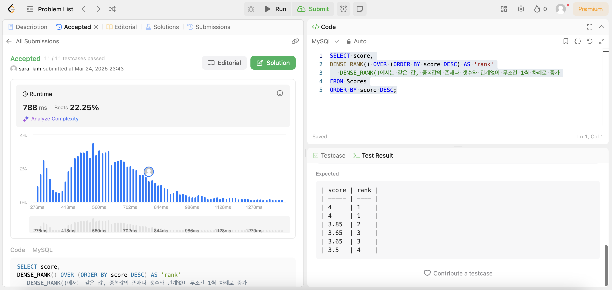
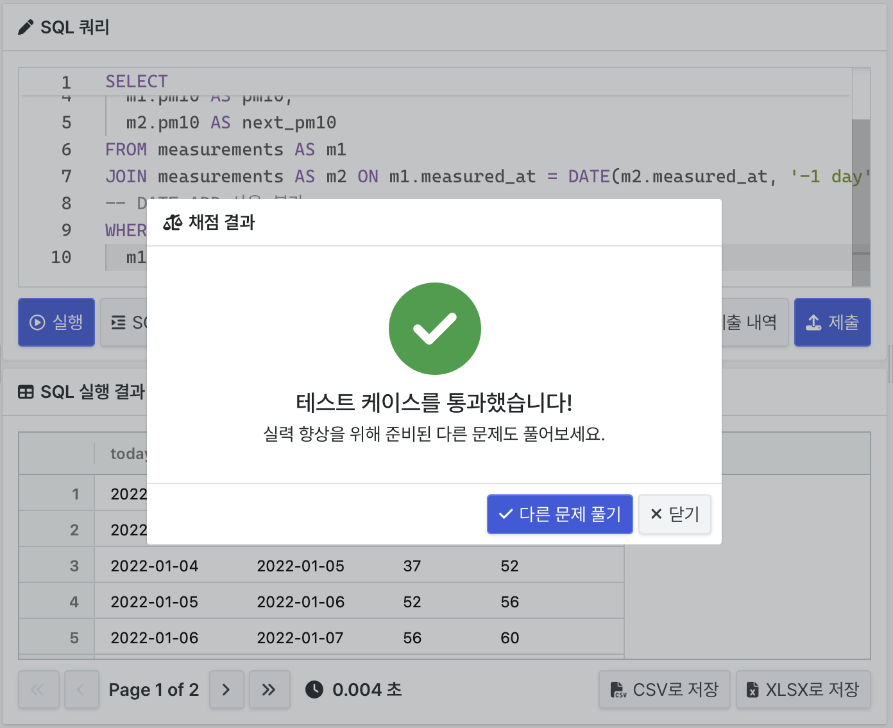
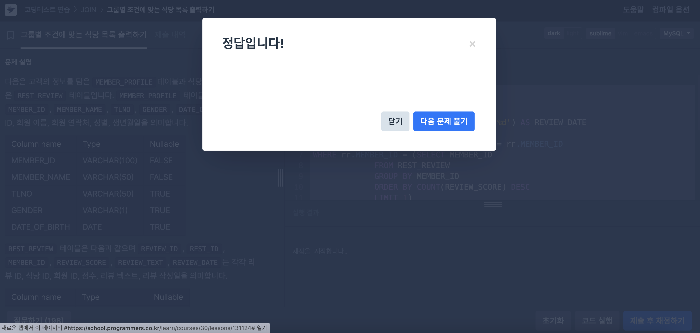

## ⭐️ 14.20.2 Window Function Concepts and Syntax

윈도우 함수는 집계 함수와 유사하지만, **각 행에 대해 결과를 반환**하는 것이 특징이다.

### 📌 윈도우 함수 주요 특징

- 집계 함수는 여러 행을 하나의 결과 행으로 반환하지만, 윈도우 함수는 각 행마다 결과를 반환한다.
- 현재 계산 중인 행을 현재 행(current row), 그와 관련된 행 집합을 윈도우(window) 라고 한다.
- 윈도우 함수는 OVER() 절과 함께 사용되며, PARTITION BY, ORDER BY, ROWS 등을 지정하여 동작 범위를 설정할 수 있다.

### 윈도우 함수 처리 순서  
- 윈도우 함수가 WHERE 절보다 나중에 처리된다!

### 윈도우 함수로 사용 가능한 집계 함수  
- AVG(), COUNT(), MAX(), MIN(), SUM() 등 다수  
- OVER 절이 붙으면 윈도우 함수, 없으면 일반 집계 함수로 작동
  
### 윈도우 함수 전용 함수 (OVER 필수)
- RANK(), DENSE_RANK(), ROW_NUMBER()  
- LAG(), LEAD(), FIRST_VALUE(), LAST_VALUE() 등

---

## ⭐️ 14.20.1 Window Function Descriptions

윈도우 전용 함수는 `OVER()` 절과 함께 반드시 사용해야 하며, 각 함수는 현재 행을 중심으로 관련 행들과의 관계를 계산한다.

### 대표 함수
- `ROW_NUMBER()`: 각 파티션 내 고유 행 번호
- `RANK()`: 동일값은 동일 순위, 건너뜀
- `DENSE_RANK()`: 동일값은 동일 순위, 건너뛰지 않음
- `LAG()`, `LEAD()`: 현재 행 기준으로 이전/다음 행의 값을 가져옴
- `FIRST_VALUE()`, `LAST_VALUE()`: 프레임 내 처음/마지막 값
- `NTH_VALUE(expr, N)`: 프레임 내 N번째 값
- `CUME_DIST()`: 누적 분포 백분율 (0~1)
- `PERCENT_RANK()`: (순위 - 1) / (전체 행 수 - 1)
- `NTILE(N)`: 파티션을 N개의 그룹으로 나눠 그룹 번호 반환

---

## ⭐️ 14.20.4 Named Windows
`WINDOW` 절을 사용하면 동일한 `OVER()` 정의를 재사용할 수 있어 **중복을 줄이고 유지보수성을 높일 수 있다.**

### 📌 문법
```sql
WINDOW w AS (PARTITION BY country ORDER BY year)
```

- `WINDOW` 절은 `HAVING`과 `ORDER BY` 사이에 위치하며, 하나 이상의 윈도우를 이름으로 정의 가능하다.
- `OVER w` 형태로 간단하게 참조할 수 있으며, 필요한 경우 `OVER (w ORDER BY ...)`처럼 일부 속성을 추가해 확장할 수도 있다.
- 단, 이미 정의된 속성과 동일한 속성을 중복 정의할 수는 없다.

### `WINDOW` 참조 규칙

```sql
-- 허용되는 참조
WINDOW w1 AS (w2), w2 AS (), w3 AS (w1);

-- 순환 참조 금지(아래)
WINDOW w1 AS (w2), w2 AS (w3), w3 AS (w1);
```
---

## ⭐️ over_clause

```sql
<윈도우 함수> OVER ([PARTITION BY ...] [ORDER BY ...] [ROWS|RANGE ...])
```

- `PARTITION BY`: 데이터를 그룹으로 나누어 윈도우 처리
- `ORDER BY`: 파티션 내 행 순서 지정
- `ROWS` / `RANGE`: 프레임 범위 지정 (기본값: `RANGE UNBOUNDED PRECEDING TO CURRENT ROW`)

> `over_clause`는 윈도우 함수 또는 집계 함수에서 반드시 사용되며, 윈도우 계산 방식 지정에 사용된다.

---
## 📝 문제 풀이
### 문제1. Rank Scores
```sql
SELECT score,
DENSE_RANK() OVER (ORDER BY score DESC) AS 'rank'
-- DENSE_RANK()에서는 같은 값, 중복값의 존재나 갯수와 관계없이 무조건 1씩 차례로 증가
FROM Scores
ORDER BY score DESC;
```


### 문제2. 다음날도 서울숲의 미세먼지 농도는 나쁨 😢
```sql
SELECT
  m1.measured_at AS today,
  m2.measured_at AS next_day,
  m1.pm10 AS pm10,
  m2.pm10 AS next_pm10
FROM measurements AS m1
JOIN measurements AS m2 ON m1.measured_at = DATE(m2.measured_at, '-1 day')
-- DATE_ADD 사용 불가
WHERE
  m1.pm10 < m2.pm10
```


### 문제3. 그룹별 조건에 맞는 식당 목록 출력하기
```sql
SELECT 
    mp.MEMBER_NAME, 
    rr.REVIEW_TEXT, 
    DATE_FORMAT(rr.REVIEW_DATE, '%Y-%m-%d') AS REVIEW_DATE
FROM MEMBER_PROFILE AS mp
JOIN REST_REVIEW AS rr ON mp.MEMBER_ID = rr.MEMBER_ID
WHERE rr.MEMBER_ID = (SELECT MEMBER_ID
             FROM REST_REVIEW
             GROUP BY MEMBER_ID
             ORDER BY COUNT(REVIEW_SCORE) DESC
             LIMIT 1)
ORDER BY REVIEW_DATE, REVIEW_TEXT;
```

```sql
WITH SUB AS (
    SELECT 
        MEMBER_ID,
        RANK() OVER (ORDER BY COUNT(REVIEW_ID) DESC) AS RANKING
    FROM REST_REVIEW
    GROUP BY MEMBER_ID
)

SELECT 
    mp.MEMBER_NAME,
    rr.REVIEW_TEXT,
    DATE_FORMAT(rr.REVIEW_DATE, '%Y-%m-%d') AS REVIEW_DATE
FROM SUB AS s
JOIN MEMBER_PROFILE mp ON s.MEMBER_ID = mp.MEMBER_ID
JOIN REST_REVIEW rr ON s.MEMBER_ID = rr.MEMBER_ID
WHERE s.RANKING = 1
ORDER BY rr.REVIEW_DATE ASC, rr.REVIEW_TEXT ASC;
```

