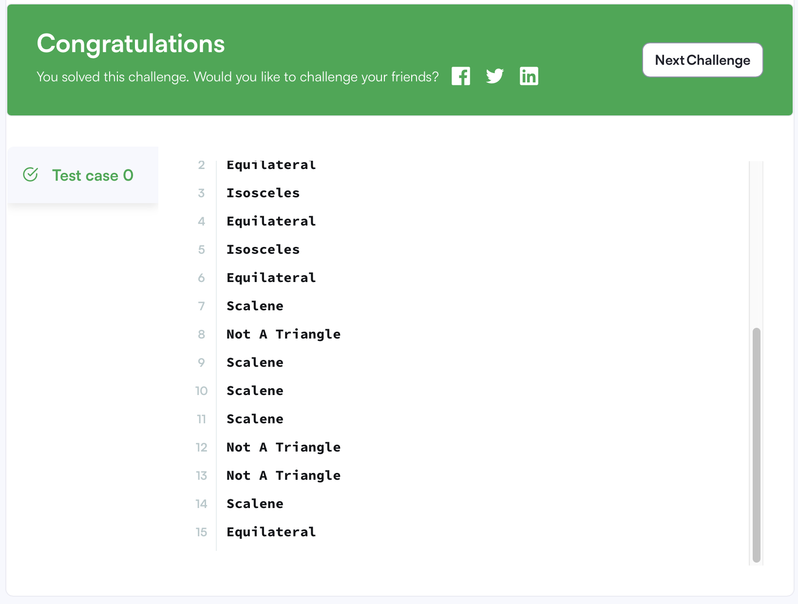
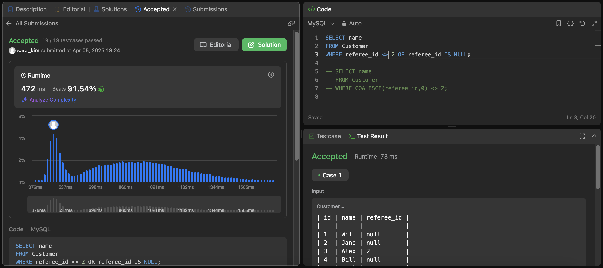

## ⭐️ 14.5 Flow Control Functions   

### CASE 표현식의 타입 결정 로직

- `CASE` 결과의 반환 타입은 모든 결과 값의 종합 타입에 따라 결정됨
- 예외적인 타입 처리:
  - `DOUBLE`이 하나라도 있으면 -> **DOUBLE**
  - `DECIMAL`이 하나라도 있으면 -> **DECIMAL**
  - 이외에는 INT 타입

### IF(expr1, expr2, expr3)

- `expr1`이 TRUE -> `expr2`, 아니면 `expr3` 반환
- 반환 타입 결정 로직:
  - 하나라도 문자열 → **문자열 반환**
  - 하나라도 실수형 → **실수형 반환**
  - 나머지는 INT형
- expr2 또는 expr3 중 하나만 `NULL`이면 NULL이 아닌 쪽 타입을 따름

### IFNULL(expr1, expr2)
```sql
SELECT IFNULL(1,0);
-> 1
SELECT IFNULL(NULL,10);
-> 10
SELECT IFNULL(1/0,10);
-> 10
SELECT IFNULL(1/0,'yes');
-> 'yes'
```

- `expr1`이 NULL이 아니면 그대로 반환, NULL이면 `expr2` 반환
- 두 인자의 타입 중 더 “일반적인” 타입이 반환됨  
  → STRING > REAL > INTEGER 순

- 임시 테이블에 저장 시 타입 결정에 주의 필요

### NULLIF(expr1, expr2)
  ```sql
  SELECT NULLIF(1,1);
  -> NULL
  SELECT NULLIF(1,2);
  -> 1
  ```
- `expr1 = expr2`일 경우 **NULL** 반환, 아니면 `expr1` 반환
- `expr1`이 두 번 평가될 수 있으므로 **부작용 있는 표현식 주의**   

- `CASE`, `IF`, `IFNULL`, `NULLIF` 사용 시 **문자셋/Collation 충돌** 가능
- 시스템 변수 사용 시:
  - 문자셋/Collation이 다르면 `Illegal mix of collations` 오류 발생 -> CAST()로 명시적 캐스팅 필요

---

## ⭐️ 14.4.2 Comparison Functions and Operators 

- 다음 연산자들은 **스칼라뿐만 아니라 행(row) 값도 비교** 가능함:  
  `=`, `>`, `<`, `>=`, `<=`, `<>`, `!=`

- 타입 변환이 필요할 경우 `CAST()` 또는 `CONVERT()` 사용 권장

- 문자열 비교는 기본적으로 **대소문자를 구분하지 않음

#### `<=>` (NULL-safe equal)

- NULL 비교 가능  
  ```sql
  SELECT NULL <=> NULL;
  → 1
  SELECT 1 <=> NULL;
  → 0
  ```

#### `<>`, `!=`

- 같지 않음  
  문자열 비교 시 주의

#### `BETWEEN min AND max`

- `expr`이 `min 이상` 그리고 `max 이하`일 경우 `1(TRUE)`, 아니면 `0(FALSE)`
- 내부적으로는 다음과 동일:
  ```sql
  min <= expr AND expr <= max
  ```
- 세 인자의 타입이 다르면 MySQL의 타입 변환 규칙(14.3절 참고)을 따름

```sql
SELECT 2 BETWEEN 1 AND 3;       → 1
SELECT 2 BETWEEN 3 AND 1;       → 0  (순서 중요)
SELECT 'b' BETWEEN 'a' AND 'c'; → 1  (문자열 비교 가능)
SELECT 2 BETWEEN 2 AND '3';     → 1  ('3'은 숫자 3으로 변환)
SELECT 2 BETWEEN 2 AND 'x-3';   → 0  ('x-3'은 숫자 변환 실패)
```

#### `COALESCE(v1, v2, ...)`   
- NULL이 아닌 첫 번째 값을 반환

#### `EXISTS(subquery)`, `NOT EXISTS(subquery)`

- 쿼리 결과가 **존재**하면 1, 없으면 0   
- 쿼리 결과가 **존재하지 않으면** 1, 존재하면 0

#### `GREATEST(v1, v2, ...)`

- 가장 큰 값 반환  
  NULL 포함 시 결과는 NULL

#### `INTERVAL(N, N1, N2, ...)`
- Returns 0 if N ≤ N1, 1 if N ≤ N2 and so on, or -1 if N is NULL.   
- `N ≤ N1` → 0, `N ≤ N2` → 1, ...  
  정수형 비교, 이진 탐색 사용   
  ```sql
  SELECT INTERVAL(23, 1, 15, 17, 30, 44, 200);
  -> 3
  SELECT INTERVAL(10, 1, 10, 100, 1000);
  -> 2
  SELECT INTERVAL(22, 23, 30, 44, 200);
  -> 0
  ```

---
## 📝 문제 풀이
### 문제1. Type of Triangle   
```sql
SELECT
    CASE WHEN (A+B <= C OR A+C <= B OR B+C <= A)THEN 'Not A Triangle'
    WHEN (A=B AND B=C) THEN 'Equilateral'
    WHEN (A=B OR B=C OR C=A)THEN 'Isosceles'
    ELSE 'Scalene'
    END AS 'Type of Triangle'
FROM TRIANGLES

-- 삼각형 조건 순서에 주의하자!!
```


### 문제2. Find Customer Referee   
```sql
SELECT name 
FROM Customer
WHERE referee_id <> 2 OR referee_id IS NULL;
-- <>와 !=는 동일
```
```sql
SELECT name
FROM Customer
WHERE COALESCE(referee_id,0) <> 2;
```

