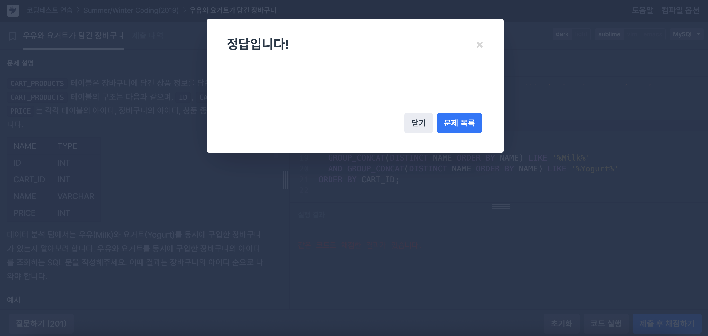
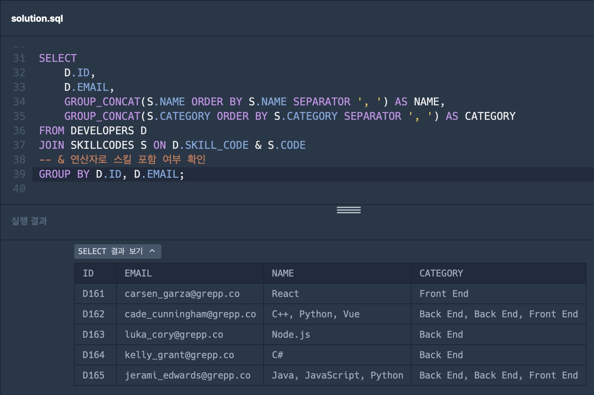
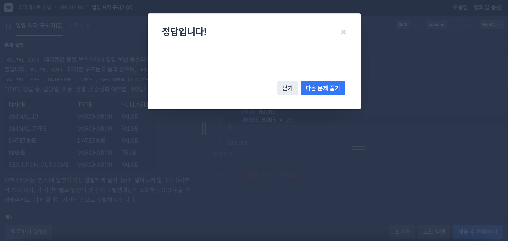

## ⭐️ 14.19.1 Aggregate Function Descriptions   

### GROUP_CONCAT() 
그룹화된 데이터를 하나로 합쳐서 조회할 수 있는 그룹 함수
- 그룹 내에서 NULL이 아닌 값을 연결하여 문자열로 반환
- 모든 값이 NULL이면 결과는 NULL

  ```sql
  mysql> SELECT student_name,
         GROUP_CONCAT(test_score)
       FROM student
       GROUP BY student_name;
  ```
---
## 📝 문제 풀이
### 문제1. 우유와 요거트가 담긴 장바구니   
```sql
SELECT CART_ID
FROM CART_PRODUCTS
GROUP BY CART_ID
HAVING 
  GROUP_CONCAT(DISTINCT NAME ORDER BY NAME) LIKE '%Milk%' 
  AND GROUP_CONCAT(DISTINCT NAME ORDER BY NAME) LIKE '%Yogurt%'
ORDER BY CART_ID;
```


### 문제2. 언어별 개발자 분류하기
```sql
SELECT 
    D.ID,
    D.EMAIL,
    GROUP_CONCAT(S.NAME ORDER BY S.NAME SEPARATOR ', ') AS NAME,
    GROUP_CONCAT(S.CATEGORY ORDER BY S.CATEGORY SEPARATOR ', ') AS CATEGORY
FROM DEVELOPERS D
JOIN SKILLCODES S ON D.SKILL_CODE & S.CODE
-- & 연산자로 스킬 포함 여부 확인
GROUP BY D.ID, D.EMAIL;
```


---

## ⭐️ 15.2.20 WITH (Common Table Expressions)   
### CTE(WITH RECURSIVE)   
자신을 참조하는 서브쿼리를 포함하는 CTE
- 종료 조건은 WHERE 절에서 명시 (없으면 무한 루프 발생)
- 재귀 SELECT는 이전 반복 결과만 사용 가능
- 너무 깊은 재귀 실행 시 성능 저하, 메모리 초과 등의 문제 발생 가능
- 다른 테이블과의 조인은 가능하지만, CTE는 LEFT JOIN의 우측에 위치해서는 안 됨
- 재귀 SELECT에서는 CTE 내부의 열 이름으로만 값을 참조하며, 열 위치(index)로 참조할 수 없음


  ```sql
  WITH RECURSIVE cte (n) AS
  (
  SELECT 1
  UNION ALL
  SELECT n + 1 FROM cte WHERE n < 5
  )
  SELECT * FROM cte;
  ```

The recursive SELECT part는 아래 constructs을 포함해서는 안됨
- Aggregate functions such as SUM()
- Window functions
- GROUP BY
- ORDER BY
- DISTINCT
*LIMIT은 MySQL 8.0.19부터 허용


---
### 문제3. 입양 시각 구하기(2)
```sql
WITH RECURSIVE HOURS AS (
    SELECT 0 AS HOUR
    
    UNION ALL
    
    SELECT HOUR + 1 
    FROM HOURS 
    WHERE HOUR < 23
)

SELECT 
    H.HOUR, 
    COUNT(AO.ANIMAL_ID) AS COUNT
FROM HOURS H
LEFT JOIN ANIMAL_OUTS AO ON H.HOUR = HOUR(AO.DATETIME)
GROUP BY H.HOUR
ORDER BY H.HOUR;
```

