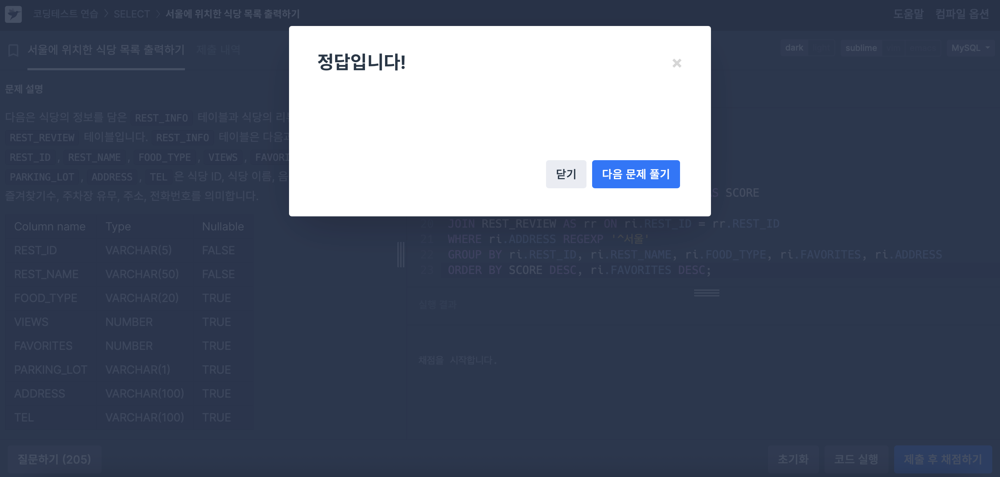
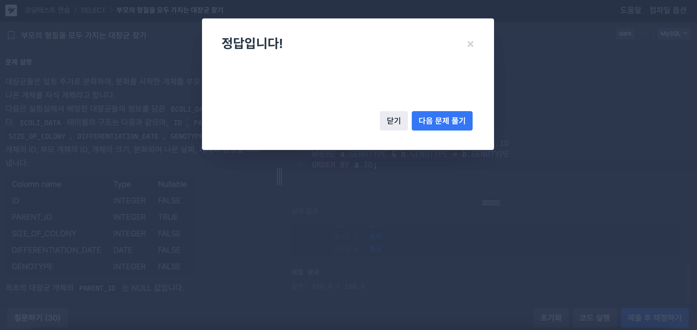

## ⭐️ 14.8.2 Regular Expressions
정규 표현식: 문자열 내에서 특정 패턴을 찾아내거나 대체할 수 있는 **패턴 기반 검색 문법**

### `REGEXP_LIKE`

> **문자열이 정규식 패턴에 부합하는지 여부를 반환** (1 또는 0)

* **패턴 매칭 여부**만 판단할 때 사용
* `match_type`으로 **대소문자 구분(c/i)**, **멀티라인(m)**, **줄바꿈 포함(n)**, **유닉스 줄 끝(u)** 등을 제어 가능
* `REGEXP`, `RLIKE`와 동의어

### `REGEXP_REPLACE`

> **정규식 패턴에 매칭되는 부분을 지정된 문자열로 대체**

* `pos`: 시작 위치 (기본 1)
* `occurrence`: 몇 번째 일치 항목만 변경할지 (기본 0은 **전부**)
* `match_type`: `REGEXP_LIKE()`와 동일한 옵션

### `REGEXP_SUBSTR`

> **패턴과 일치하는 첫 (또는 N번째) 하위 문자열 반환**

* `NULL` 반환 가능 (일치 항목 없음 시)
* `pos`, `occurrence`, `match_type` 사용 가능

### Pattern Syntax

| 패턴                | 의미                                    |             |
| ----------------- | ------------------------------------- | ----------- |
| `^`               | 문자열 시작 anchor                         |             |
| `$`               | 문자열 끝 anchor                          |             |
| `.`               | 임의의 한 문자                              |             |
| `a*`, `a+`, `a?`  | 0개 이상 / 1개 이상 / 0\~1개                 |             |
| `{n}`, `{m,n}`    | 반복 수 지정                               |             |
| `[abc]`, `[^abc]` | 문자 집합 포함 / 제외                         |             |
| \`a               | b\`                                   | OR (a 또는 b) |
| `(abc)`           | 그룹화                                   |             |
| `\b`              | 단어 경계 (ICU에서는 `[:<:]`, `[:>:]` 사용 불가) |             |
| `[[:digit:]]`     | 숫자                                    |             |
| `[[:alpha:]]`     | 알파벳 문자                                |             |
| `[[:alnum:]]`     | 알파벳 또는 숫자                             |             |

## 📝 문제 풀이
### 문제1. 서울에 위치한 식당 목록 출력하기
```sql
-- 정규 표현식을 사용하지 않고 푼 경우
SELECT ri.REST_ID, 
       ri.REST_NAME, 
       ri.FOOD_TYPE, 
       ri.FAVORITES, 
       ri.ADDRESS, 
       ROUND(AVG(rr.REVIEW_SCORE), 2) AS SCORE
FROM REST_INFO AS ri
JOIN REST_REVIEW AS rr ON ri.REST_ID = rr.REST_ID
WHERE ri.ADDRESS LIKE '서울%'
GROUP BY ri.REST_ID, ri.REST_NAME, ri.FOOD_TYPE, ri.FAVORITES, ri.ADDRESS
ORDER BY SCORE DESC, ri.FAVORITES DESC;
```
```sql
-- 정규 표현식을 사용해서 푼 경우
SELECT ri.REST_ID, 
       ri.REST_NAME, 
       ri.FOOD_TYPE, 
       ri.FAVORITES, 
       ri.ADDRESS, 
       ROUND(AVG(rr.REVIEW_SCORE), 2) AS SCORE
FROM REST_INFO AS ri
JOIN REST_REVIEW AS rr ON ri.REST_ID = rr.REST_ID
WHERE ri.ADDRESS REGEXP '^서울'
GROUP BY ri.REST_ID, ri.REST_NAME, ri.FOOD_TYPE, ri.FAVORITES, ri.ADDRESS
ORDER BY SCORE DESC, ri.FAVORITES DESC;
```
REGEXP '^서울' → 정규표현식에서 문자열 시작(^) + '서울'로 시작하는 문자열과 일치하도록 수정



## 📝 문제 풀이
### 문제2. 부모의 형질을 모두 가지는 대장균 찾기
```sql
SELECT
    a.ID,
    a.GENOTYPE,
    b.GENOTYPE AS PARENT_GENOTYPE
FROM ECOLI_DATA AS a
JOIN ECOLI_DATA AS b ON a.PARENT_ID = b.ID
WHERE a.GENOTYPE & b.GENOTYPE = b.GENOTYPE
ORDER BY a.ID;
```


