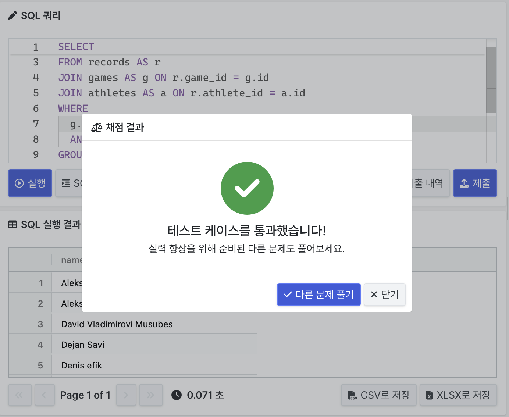
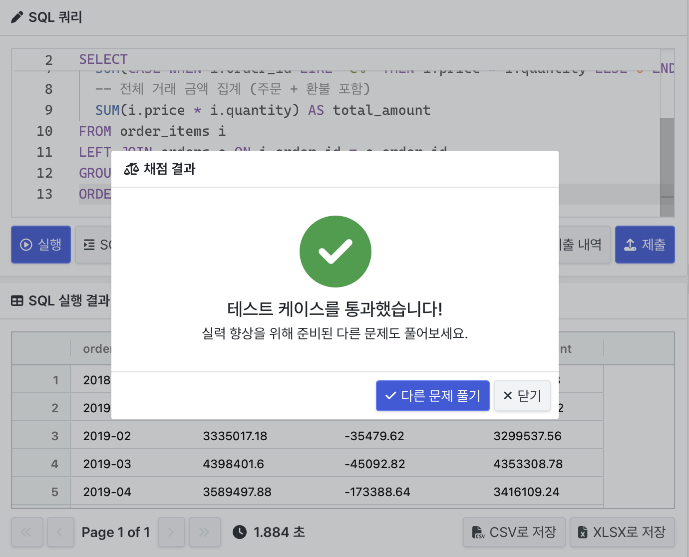
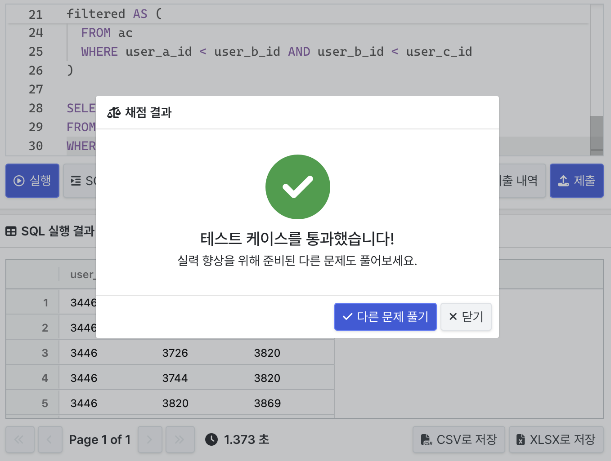

## 📝 문제 풀이
### 문제1. 복수 국적 메달 수상한 선수 찾기

```sql

```


### 문제3. 온라인 쇼핑몰의 월 별 매출액 집계

```sql

```


### 문제3. 세 명이 서로 친구인 관계 찾기
```sql
WITH ab AS (
  -- A → B → C 경로 생성: A가 B와 친구이고, B가 C와 친구인 경우
  SELECT e1.user_a_id AS a, e1.user_b_id AS b, e2.user_b_id AS c
  FROM edges e1
  JOIN edges e2 ON e1.user_b_id = e2.user_a_id
),
triangles AS (
  -- A와 C도 친구인 경우만 필터링 (A-C는 대칭이므로 양 방향 모두 확인)
  SELECT a, b, c
  FROM ab
  JOIN edges e ON (a = e.user_a_id AND c = e.user_b_id)
              OR (a = e.user_b_id AND c = e.user_a_id)
),
filtered AS (
  SELECT *
  FROM triangles
  WHERE a < b AND b < c
)

SELECT *
FROM filtered
WHERE 3820 IN (a, b, c);
```

