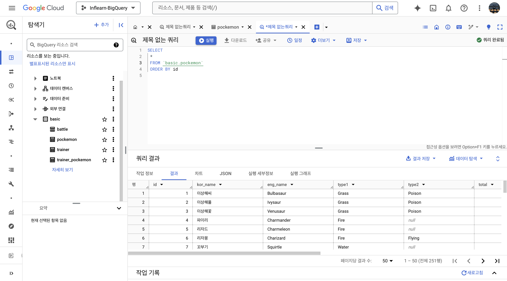

## 1-1. BigQuery 기초 지식


### 데이터의 저장 형태
데이터는 보통 DB 테이블 등에 저장
DB: 데이터의 저장소
Table: 데이터가 저장된 공간

저장되는 장소
MySQL, Oracle, PostgreSQL 등
거래를 하기 위해 사용되는 DB(OLTP)
보류, 중간 상태가 없어 데이터 무결성
분석을 위해 만든 DB가 아니라 쿼리 속도가 느릴 수 있다

### SQL
DB에서 데이터를 가지고 올 때 사용하는 언어
데이터를 관리하기 위해 설계된 특수 목적의 프로그래밍 언어

### 테이블에 저장된 데이터 형태
||Column1|Column2|Column3|
|---|---|---|---|
|Row1||||
|Row2||||
|Row3||||

행(Row): 가로 한 줄
하나의 row가 하나의 고유한 데이터
열(Column): 세로 
각 데이터의 특정 속성 값

Column=속성, Row=속성을 묶은 하나의 데이터

### OLAP
OLTP를 개선한 OLAP 등장
분석을 위한 기능을 제공하는 서비스

### 데이터 웨어하우스
데이터를 한 곳에 모아서 저장하는 일종의 창고

### BigQuery
Google Cloud의 OLAP 겸 데이터 웨어하우스. 
난이도가 쉽고 속도가 빠르다. 
구글이 클라우드 관리를 해주기 때문에 별도의 서버를 띄울 필요가 없다.

회사에서 앱이나 웹에 파이어베이스, 구글애널리틱스4를 사용하는 경우 적은 운영비용을 위해 사용한다.

프로젝트: 하나의 큰 건물. 여러개의 데이터셋이 존재할 수 있음.

데이터 셋: 프로젝트에 있는 창고.

테이블: 창고에 있는 선반. 테이블 안에 행과 열로 이루어진 데이터들이 저장.

## 1-2. BigQuery 환경 설정


## 2-1. 데이터 활용 Overview

### 데이터를 활용하는 과정
```
해야하는 일
 -> 원하는 것 정하기
 -> 데이터 탐색
|   -> 단일자료 / 다량의자료-연결
|       -> 조건(필터링) / 추출 / 변환 / 요약
|
 -> 데이터 결과 검증
 -> 피드백 / 활용
```

## 2-2. 저장된 데이터 확인하기

### SQL 쿼리 작성 전 생각해볼 것
* 데이터가 어떻게 저장되어 있는가
* 어떤 데이터가 저장되어 있는가?
* 컬럼의 의미는 무엇인가

데이터를 추출하기 전에 데이터 웨어하우스에 데이터가 어떻게 저장되어있는지 확인

어떻게?
* ERD: 테이블 별 컬럼 확인, 테이블 별 연결 확인

