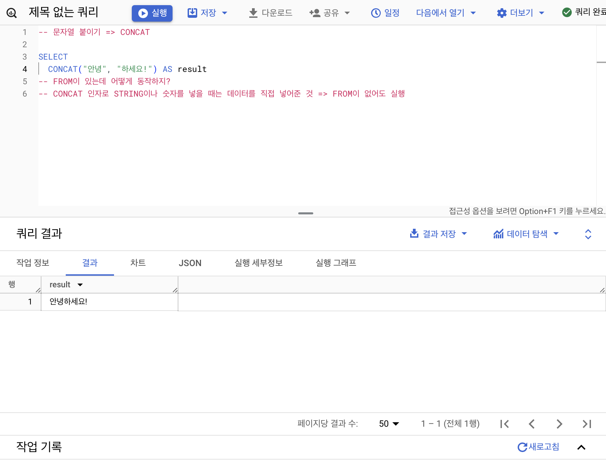
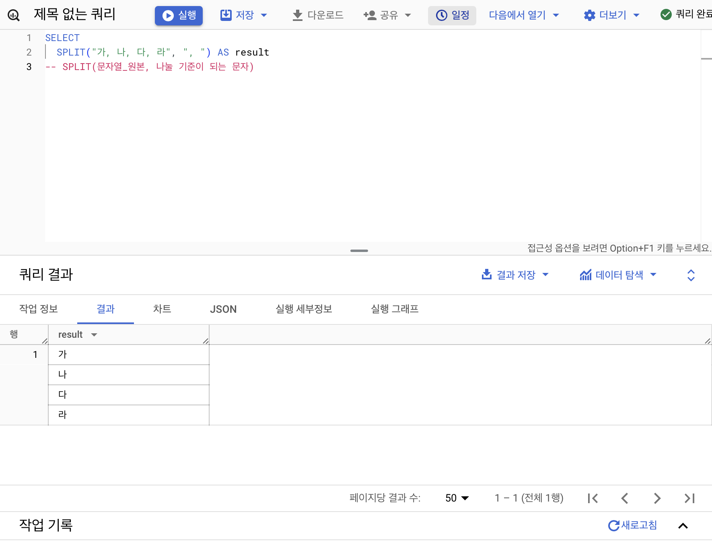
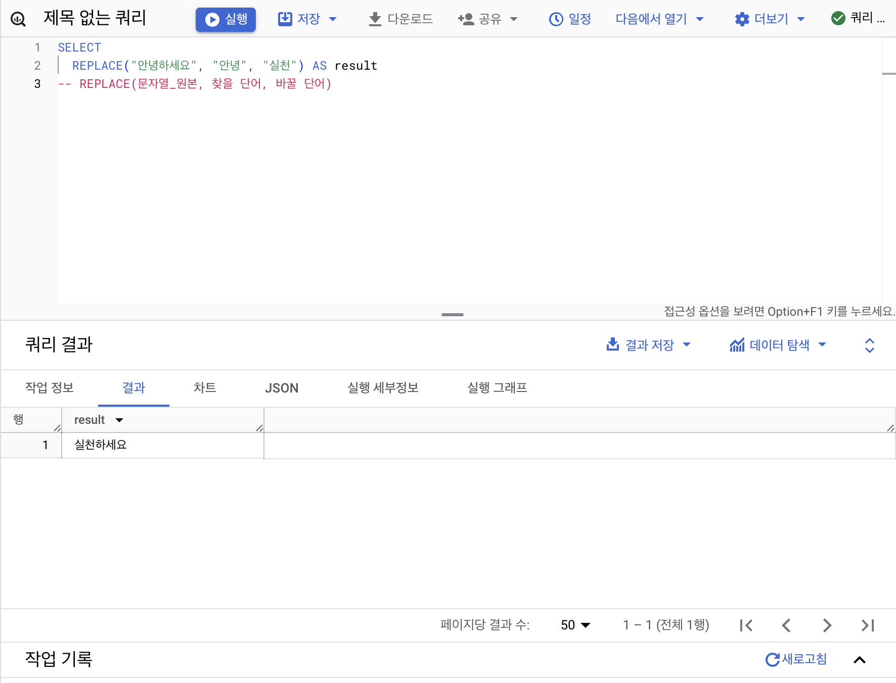
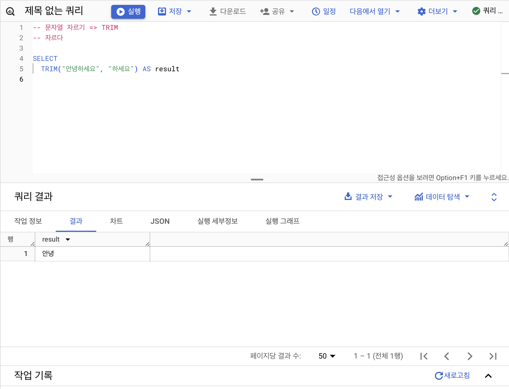
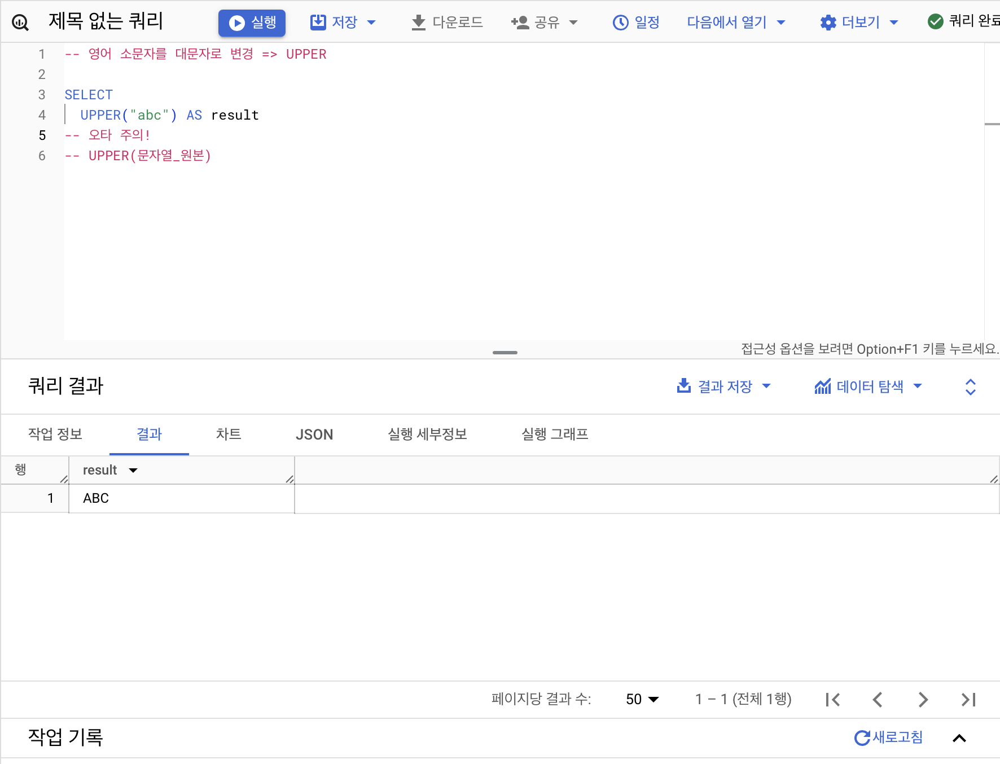
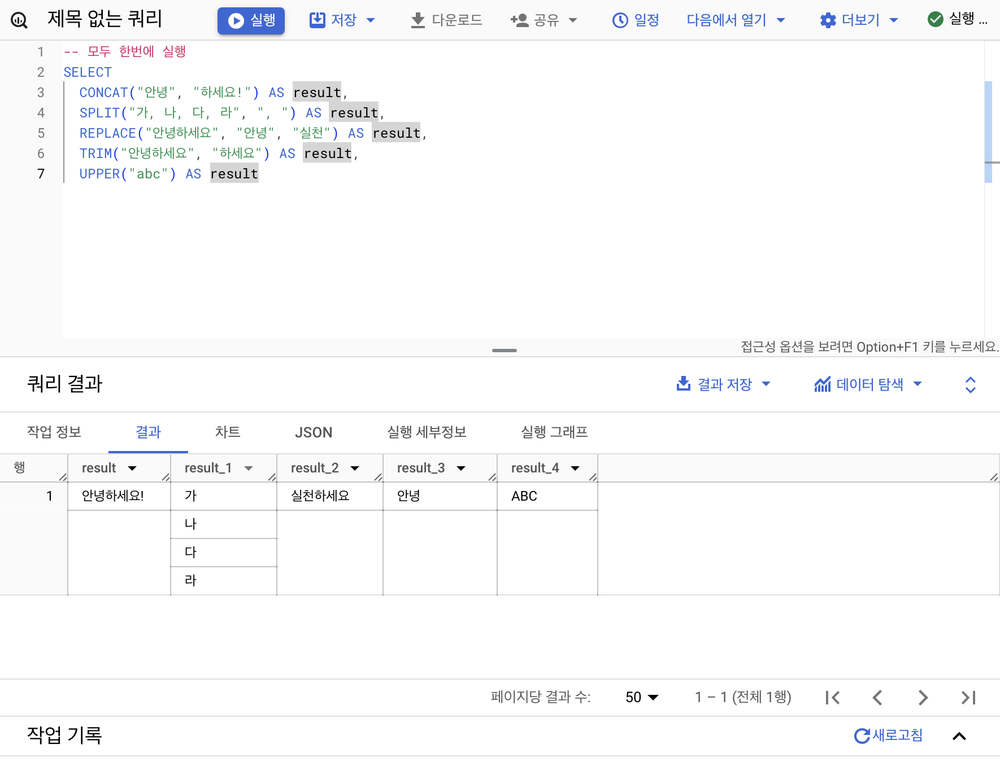
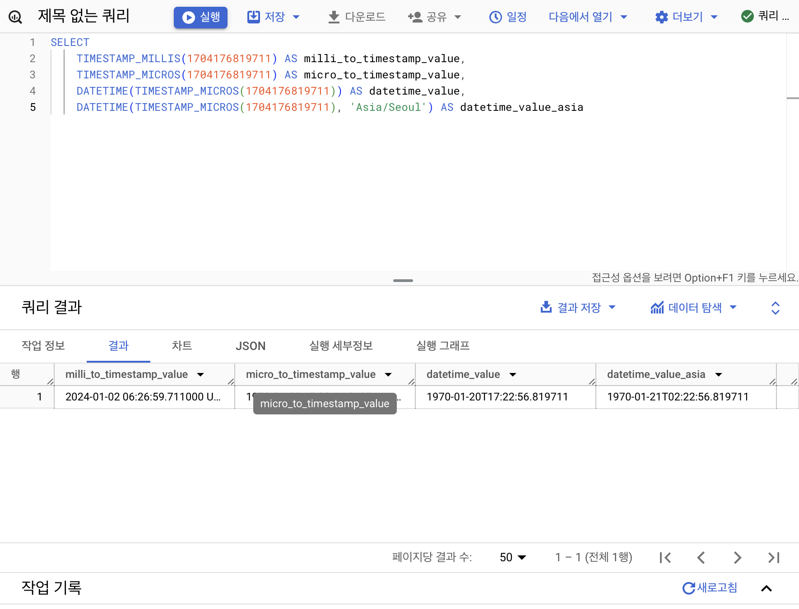

## 3-4. 오류를 디버깅하는 방법
### 오류의 정의
오류: 부정확하거나 잘못된 행동

현재 작성한 방식으로 하면 답을 얻을 수 없거나 어떤 부분에 문제가 된 다는 것을 알려주고자 하는 것. 즉, 길잡이 역할과 문제 진단을 해준다.

더 좋은 길로 나가기 위한 길잡이로 받아들이자!
### Syntax Error(문법 오류)
* 문법을 지키지 않아 생기는 오류
* 에러 메세지를 보고 해결 방법 찾아보기(구글 검색, 챗지피티, 지인 등)


## 4-1. INTRO
데이터를 어떻게 변환할 것인가?

## 4-2. 데이터 타입과 데이터 변환(CAST, SAFE_CAST)
### 변환을 위한 함수
SELECT, WHERE 문에서 데이터를 변환시킬 수 있다.

* 데이터 타입: 숫자, 문자, 시간, 날짜, 부울(Bool), Json, Array 등
* 데이터 타입이 중요한 이유: 보이는 것과 저장된 것의 차이가 존재한다. 그러므로 내 생각과 다른 경우 데이터의 타입을 서로 변경해야한다.

* 자료 타입 변경
    * CAST 
    ```SQL
    SELECT
        CAST(1 AS STRING) # 숫자 1을 문자 1로 변경
    ```

    * SAFE_CAST: 더 안전하게 변경하기. 변환 실패하는 경우 null 반환</br> 수학 연산을 하는 경우 SAFE_DIVIDE함수를 사용하면 0으로 나누는 오류를 zero error로 걸러낼 수 있다.
    ```SQL
    SELECT
        SAFE_CAST("abc" AS INT64) # 숫자 1을 문자 1로 변경
    ```

## 4-3. 문자열 함수(CONCAT, SPLIT, REPLACE, TRIM, UPPER)
### CONCAT
문자열 붙이기 함수
```
CONCAT(컬럼1, 컬럼2, ...)
```


### SPLIT
문자열 나누기 함수. 결과값 배열
```
SPIT(문자열_원본, 나눌 기준이 되는 문자)
```

### REPLACE
문자열 바꾸기 함수
```
REPLACE(문자열_원본, 찾을 단어, 바꿀 단어)
```

### TRIM
문자열 자르기 함수
```
TRIM(문자열_원본, 자를 단어)
```

### UPPER
소문자를 대문자로 바꿔주는 함수
```
UPPER(문자열_원본)
```

### 한 번에 실행하는 것도 가능



## 4-4. 날짜 및 시간 데이터 이해하기(1)(타임존, UTC, Millisecond, TIMESTAMP/DATETIME)
### DATE
DATE만 표시하는 데이터

### DATETIME
DATE와 TIME까지 표시하는 데이터. 결과값 맨 뒤에 T가 나옴

### TIME까지
DATE와 무관하게 TIME만 표시하는 데이터
* GMT: 영국 그리니치 천문대를 기준으로 한 시간
* UTC: 국제 표준시
* milliesecond: 시간의 단위, 천분의 1초 (milliesecond->TIMESTAMP->DATETIME)
* microsecond: 밀리세컨즈의 천분의 1

### TIMESTAMP
UTC로부터 경과한 값. 결과값 맨 뒤에 UTC가 나옴




