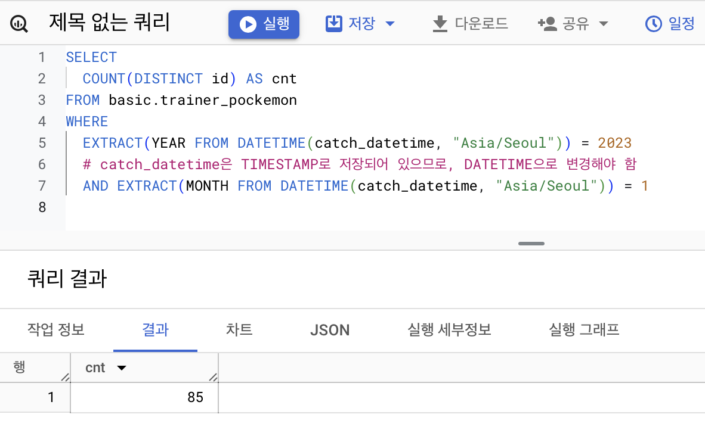
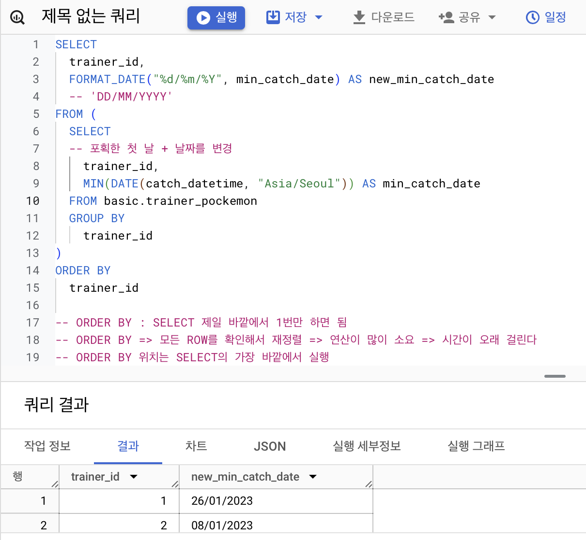
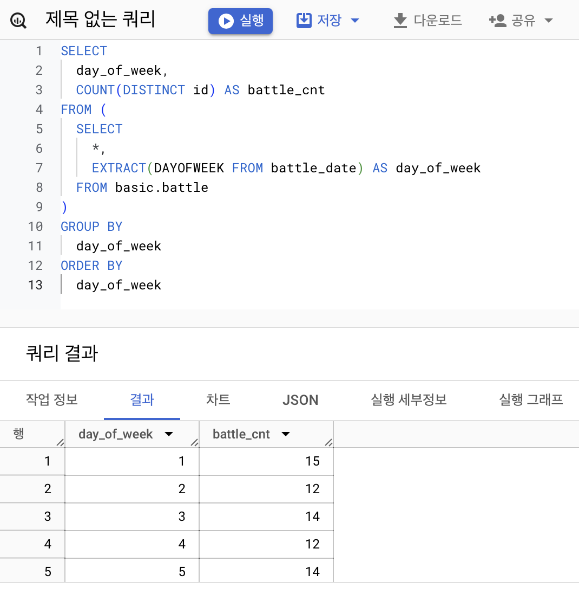
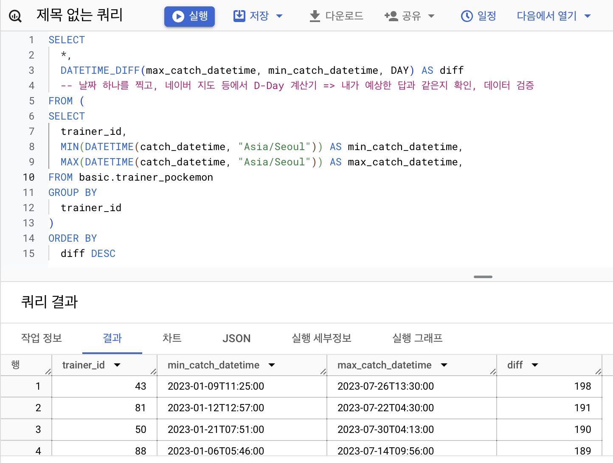
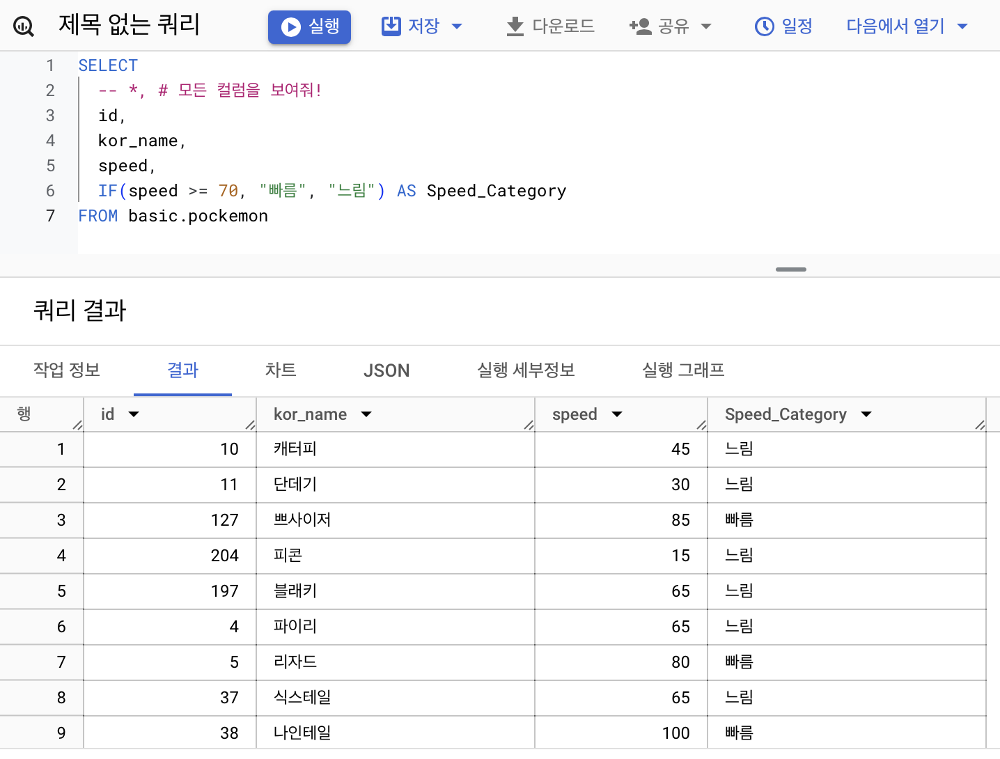
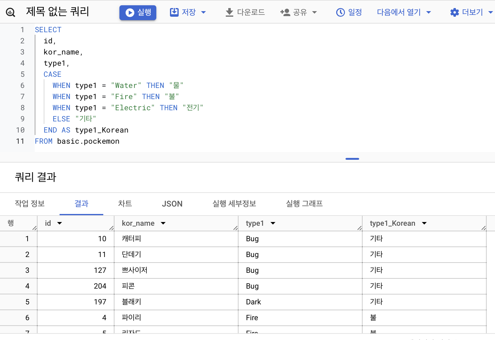
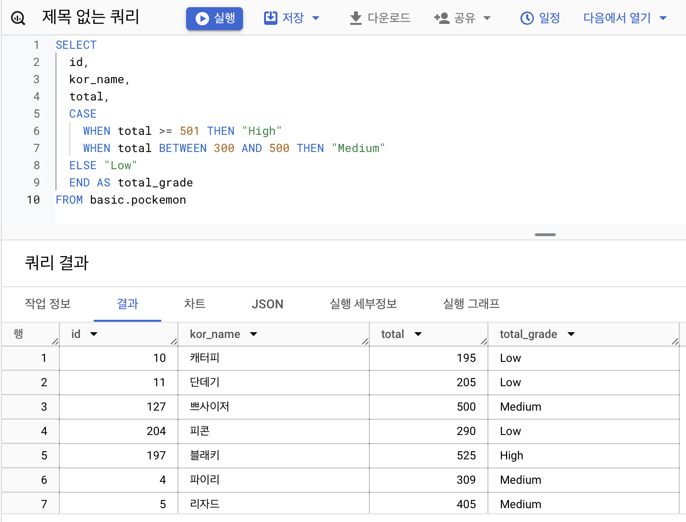
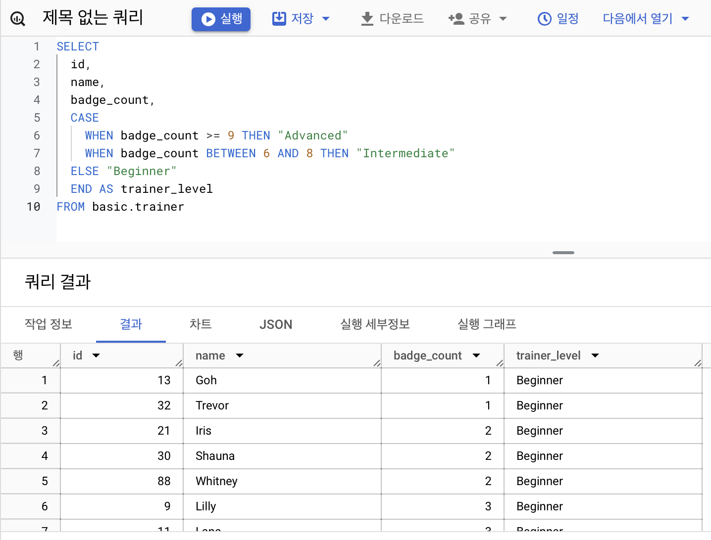
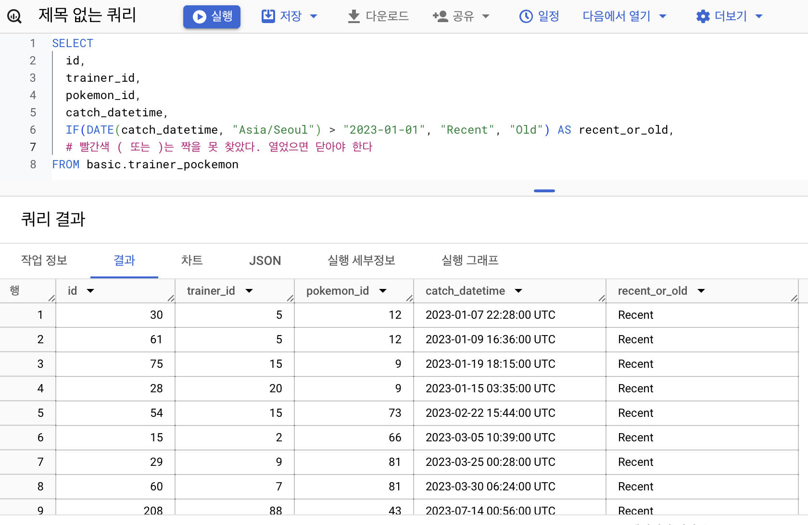
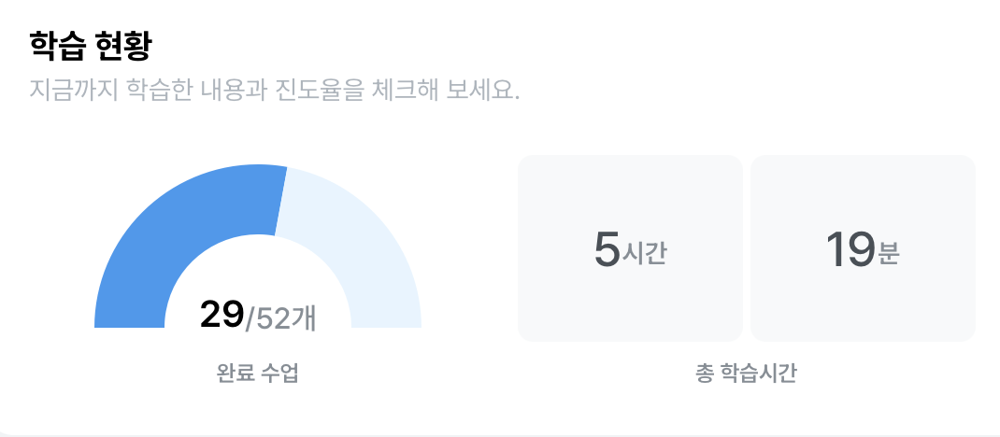

## 4-4. 날짜 및 시간 데이터 이해하기(2)(EXTRACT, DATETIME_TRUNC, PARSE_DATETIME, FORMAT_DATETIME)
### CURRENT_DATETIME([time_zone]): 현재 DATETIME 출력
타임존 설정에 주의!

### EXTRACT: DATETIME에서 특정 부분만 추출하고 싶은 경우
* EXTRACT(part FROM DATETIME)AS: DATETIME의 특정 부분 추출
    * part: date,year, month, day, hour, minute
* DAYOFWEEK: 한 주의 첫날이 일요일인 [1,7]범위의 값을 반환
* DATETIME_TRUNC: DATE와 HOUR만 남기고 싶은 경우 시간 자르기, 설정 단위로 자르고 그 뒤는 가장 작은값으로 표시
* PARSE_DATETIME: 문자열로 저장된 DATETIME을 DATETIME타입으로 변경
* FORMAT_DATETIME: DATETIME 타입 데이터를 문자열로 변경
* LAST_DAY: 마지막 날을 알고싶은 경우(자동으로 월의 마지막 값을 계산해서 특정 연산을 할 경우), default = MONTH
* DATETIME_DIFF: 두 DATETIME의 차이를 알고싶은 경우
>>대표적인 함수만 기억하고 필요할 때 찾아서 사용하기

## 4-5. 시간데이터 연습문제 1~2번
### 1. 트레이너가 포켓몬을 포획한 날짜(catch_date)를 기준으로, 2023년 1월에 포획한 포켓몬의 수를 계산해주세요.

>요청 한 사람 또는 문제를 그대로 볼 경우에 틀릴 수 있다. 컬럼을 꼭 파악하고 쿼리를 작성하자!

데이터 타입이 제대로 저장되어있는지, 타임존이 제대로 설정 되어 있는지 확인하기
컬럼의 설명을 꼭 확인하고 SQL을 작성해야 한다!

### 2. 배틀이 일어난 시간(battle_datetime)을 기준으로, 오전 6시에서 오후 6시 사이에 일어난 배틀의 수를 계산해주세요.

```SQL
EXTRACT(HOUR FROM battle_datetime) >= 6
AND EXTRACT(HOUR FROM battle_datetime) <= 18
```
간단히 적기
```SQL
EXTRACT(HOUR FROM battle_datetime) BETWEEN 6 and 18
*BETWEEN a and b => a와 b 사이에 있는 것을 반환*
```

## 4-5. 시간 데이터 연습문제 3~5번
### 3. 각 트레이너별로 그들이 포켓몬을 포획한 첫 날(catch_date)을 찾고, 그 날짜를 'DD/MM/YYYY' 형식으로 출력해주세요.


### 4. 배틀이 일어난 날짜(battle_date)를 기준으로, 요일별로 배틀이 얼마나 자주 일어났는지 계산해주세요.


### 5. 트레이너가 포켓몬을 처음으로 포획한 날짜와 마지막으로 포획한 날짜의 간격이 큰 순으로 정렬하는 쿼리를 작성해주세요.


## 4-6. 조건문(CASE WHEN, IF)
조건문: 특정 조건이 충족되면 어떤 행동을 함
조건문을 사용하는 이유: 특정 카테고리를 하나로 합치는 전처리가 필요할 때
### CASE WHEN: 여러 조건이 있을 경우 사용, row 순서대로 실행하기 때문에 순서가 중요하다!
```SQL
SELECT
    CASE
        WHEN 조건1 THEN 조건1이 참일 경우 결과
        WHEN 조건2 THEN 조건2이 참일 경우 결과
        ELSE 그 외 경우 결과
    END AS 새로운_컬럼_이름
```
*문자열 함수에서 이슈가 자주 발생하니 주의

### IF: 단일 조건일 경우 유용
```SQL
IF(조건문, True일 때의 값, False일 때의 값)AS 새로운_컬럼_이름
```
## 4-7. 조건문 연습 문제
### 1.  포켓몬의 'Speed'가 70 이상이면 '빠름', 그렇지 않으면 '느림'으로 표시하는 새로운 컬럼 'Speed_Category'를 만들어 주세요


### 2. 포켓몬의 'type1'에 따라 'Water', 'Fire', 'Electric' 타입은 각각 '물', '불', '전기'로, 그 외 타입은 '기타'로 분류하는 새로운 컬럼 'type_Korean'을 만들어 주세요


### 3. 각 포켓몬의 총점(total)을 기준으로, 300 이하면 'Low', 301에서 500 사이면 'Medium', 501 이상이면 'High'로 분류해주세요


### 4. 각 트레이너의 배지 개수(badge_count)를 기준으로, 5개 이하면 'Beginner', 6개에서 8개 사이면 'Intermediate', 그 이상이면 'Advanced'로 분류해주세요.


### 5.  트레이너가 포켓몬을 포획한 날짜(catch_date)가 '2023-01-01' 이후이면 'Recent', 그렇지 않으면 'Old'로 분류해주세요.

* "Recent" AS recent_value 
* 모든 컬럼에 동일한 값을 추가하고 싶을 때는 이렇게 문자를 바로 작성해도 된다

### 6. 배틀에서 승자(winner_id)가 player1_id와 같으면 'Player 1 Wins', player2_id와 같으면 'Player 2 Wins', 그렇지 않으면 'Draw'로 결과가 나오게 해주세요


```
# 쿼리를 작성하는 목표, 확인할 지표 : 
# 쿼리 계산 방법 : 
# 데이터의 기간 : 
# 사용할 테이블: 
# Join KEY : 
# 데이터 특징 :
```
위의 항목들 차근차근 적어가면서 쿼리 작성하는 연습!

## 4-8. 정리
### 데이터 타입
* 숫자
    * 사칙연산
    * SAFE_DIVIDE
* 문자
    * CONCAT
    * SPLIT
    * REPLACE
    * TRIM
    * UPPER
    * 모두 기억 하는 게 아니라 유형을 알아두고 필요할 때 찾아쓰기!
* 시간, 날짜
    * EXTRACT
    * DATETIME_TRUNC
    * PARSE_DATETIME
* 부울(Bool)
    * CASE WHEN
    * IF

## 4-9. BigQuery 공식 문서 확인하는 법
### 개발 공식 문서
* 찾는 방법: "기술명 + documentation"으로 검색
* BigQuery는 구글 클라우드 문서로 확인 가능

* 꼭 봐여한다기보단 잘못된 경우나 과거 문법인 경우가 존재하므로 공식문서를 확인해볼 수 있어야 함!
* RSS Feed 구독!
>fedd subscirbe https://cloud.google.com/feeds/bigquery-release-notes.xml


