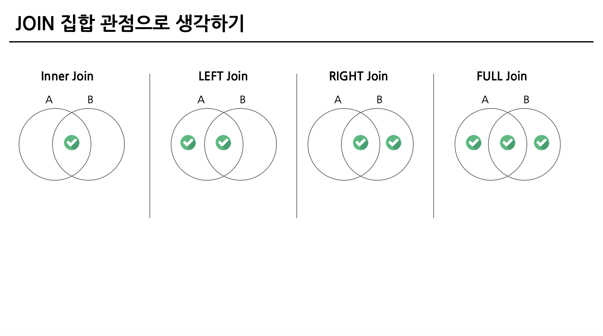
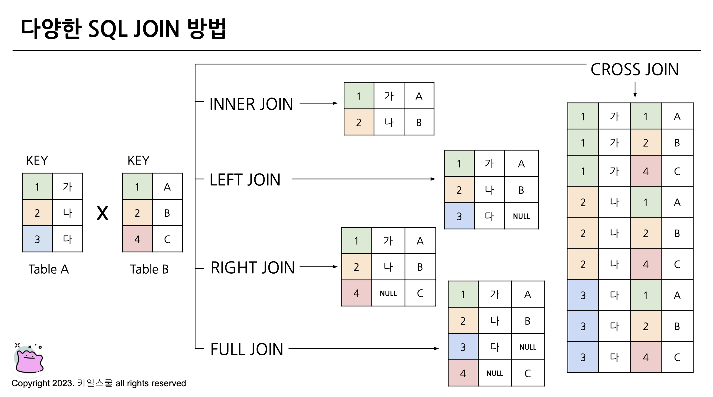
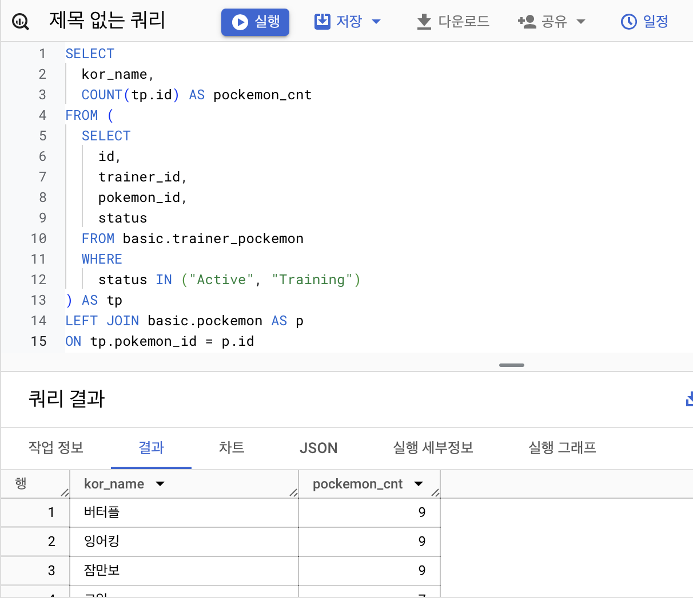
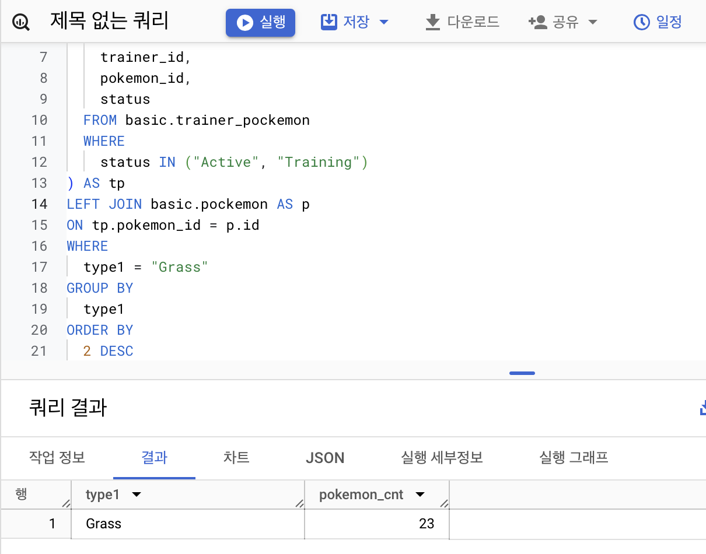
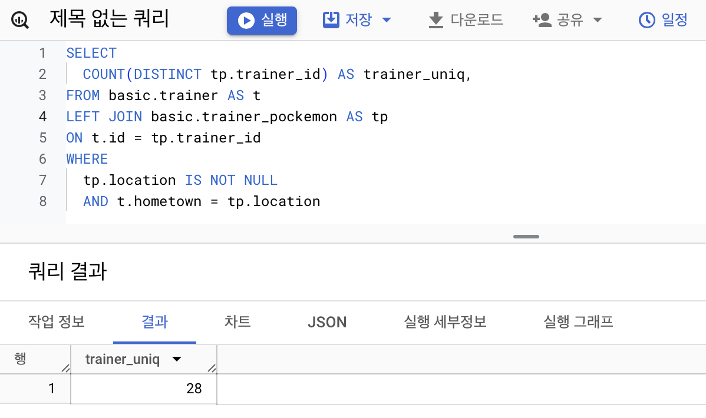
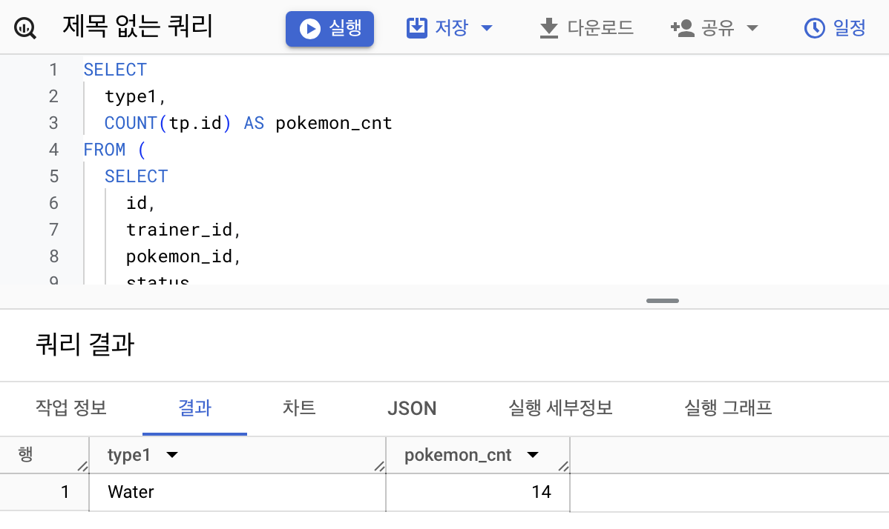
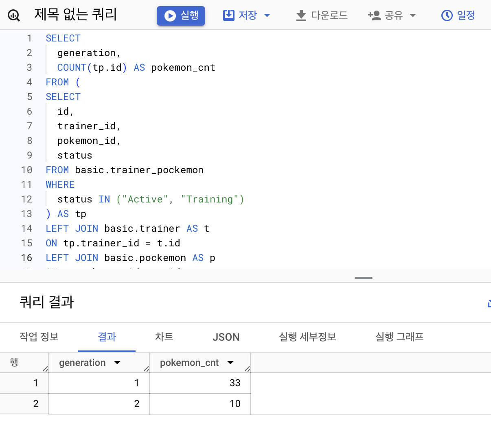
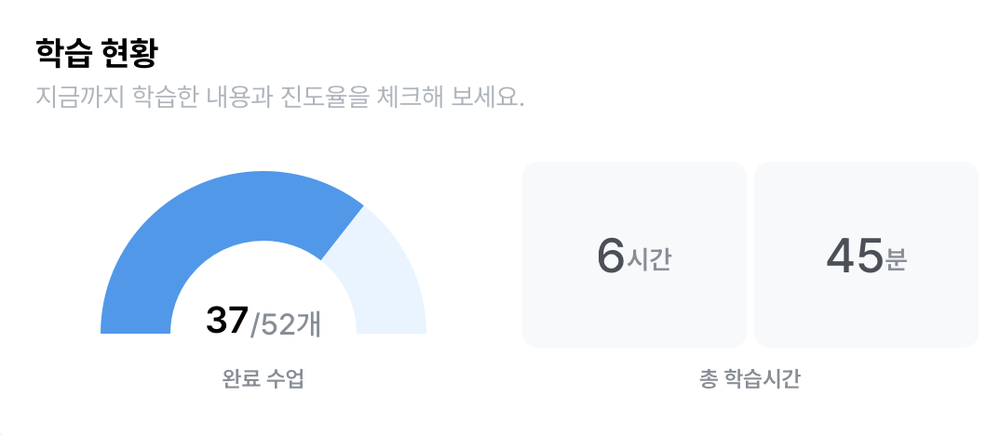

## 5-1. Intro
### JOIN: 자료를 합치는 과정

## 5-2. JOIN 이해하기
### SQL JOIN
-  서로 다른 데이터 테이블을 연결하는 것 (많은 문제 풀이를 통한 체화가 효과적)
- 공통적으로 존재하는 컬럼(=Key)이 있다면 JOIN할 수 있음
    - 보통 id값을 Key로 많이 사용
    - 특정 범위 (예:Date) JOIN도 가능

**포켓몬으로 JOIN 이해하기**
P: 트레이너 데이터와 포켓몬 데이터를 연결할 수 있는 공통 값이 없음!

-> trainer_pokemon 데이터로 트레이너와 포켓몬을 연결할 수 있다
- 연결할 수 있는 Key = trainer_id, id
- trainer_id 컬럼 기준으로 트레이너 데이터를 연결(단계적으로 뒤에 이어 붙이는 형식)

### JOIN을 해야하는 이유(데이터가 저장되는 형태에 대한 이해)
- 관계형 DBMS 설계시 거치는 정규화를 거쳐 중복을 최소화하게 데이터를 정규화
- 각 테이블 별로 따로 저장된 데이터를 다양한 테이블에 저장해서 사용할 때 조인 사용
- 분석 관점에서는 미리 조인 되어있는 것이 좋아보이나 개발 관점에서는 분리되어 있는 것이 좋다

## 5-3. 다양한 JOIN 방법

### (INNER) JOIN
: 공통 요소만 이어 붙이기

### LEFT/RIGHT (OUTER) JOIN
LEFT JOIN: 왼쪽 테이블 그대로 두고 뒤에 붙이기
RIGHT JOIN: 오른쪽 테이블 그대로 두고 뒤에 붙이기

### FULL(OUTER) JOIN
: 모든 요소 붙이기(없는 값은 null 처리)

### CROSS JOIN
: 곱셈처럼 처리, 모든 요소 분배



## 5-4. JOIN 쿼리 작성하기
- 테이블 확인: 테이블에 저장된 데이터, 컬럼 확인
- 기준 테이블 정의: 가장 많이 참고할 기준 테이블 정의
- JOIN Key 찾기: 여러 테이블과 연결할 Key 정리
- 결과 예상하기: 결과 테이블을 예상해서 손, 엑셀로 작성 - 일종의 정답지 역할
- 쿼리 작성 / 검증: 예상한 결과와 동일한 결과가 나오는지 확인

```SQL
SELECT
 col
FROM table_a AS A
LEFT JOIN table_b AS B
ON A.key = B.key
```

## 5-5. JOIN을 처음 공부할 때 헷갈렸던 부분
### 여러 JOIN 중 어떤 것을 사용해야할까
- 하려고 하는 목적에 따라 선택하기
    - 교집합: LEFT
    - 모두 다 조합: CROSS
    - 그게 아니라면: LEFT RIGHT(LEFT를 추천)
### 어떤 테이블을 왼쪽에 두고 어떤 테이블이 오른쪽에 가야할까?(LEFT JOIN 에서)
- 기준이 되는 테이블을 왼쪽에 두기
- 기준에는 기준값이 존재하고 우측에 데이터를 계속 추가
### 여러 테이블을 연결할 수 있는걸까?
- 한계는 없지만 너무 많이 하고 있지는 않은지 확인
- 그래도 너무 많이 해야한다면 중간 테이블을 하나 만들자!
### 컬럼은 모두 다 선택해야할까?
- 데이터를 추출해서 뭘 하고자 하느냐에 따라 다름
- 처음엔 많은 컬럼을 선택해도 괜찮으나 사용하지 않을 컬럼은 선택하지 않는 것이 비용을 줄일 수 있어서 좋음(EXCEPT)
- id값은 자주 사용하는 편

### NULL이 뭘까?
- 값이 없음, 알 수 없음
- 0이나 공백과 다르게 아얘 값이 없는 것
- JOIN 에서는 연결할 값이 없는 경우 나타남

## 5-6. JOIN 연습문제 1~2번
### 1. 트레이너가 보유한 포켓몬들은 얼마나 있는지 알 수 있는 쿼리를 작성해주세요
- 연산량 관점에서 테이블들을 row를 먼저 줄이고 JOIN이 효율적
- JOIN에서 사용하는 테이블에 중복된 컬럼의 이름이 있으면 꼭 어떤 테이블의 컬럼인지 명시해야 함 (id => tp.id)
```sql
SELECT
  kor_name,
  COUNT(tp.id) AS pokemon_cnt
FROM (
  SELECT
    id,
    trainer_id,
    pokemon_id,
    status
  FROM basic.trainer_pokemon
  WHERE
    status IN ("Active", "Training")
) AS tp
LEFT JOIN basic.pokemon AS p
ON tp.pokemon_id = p.id
GROUP BY
  kor_name
ORDER BY
  pokemon_cnt DESC
```



### 2. 각 트레이너가 가진 포켓몬 중에서 'Grass' 타입의 포켓몬 수를 계산해주세요
- 기준이 되는 테이블은 내가 구하고자 하는 데이터가 어디에 제일 잘 저장되어 있는가?
- JOIN을 할 수 있는 Key 같아 보이는 것이 많은 테이블을 제일 왼쪽으로 둠 (예외도 있음)
```sql
SELECT
  p.type1,
  COUNT(tp.id) AS pokemon_cnt
FROM (
  SELECT
    id,
    trainer_id,
    pokemon_id,
    status
  FROM basic.trainer_pokemon
  WHERE
    status IN ("Active", "Training")
) AS tp
LEFT JOIN basic.pokemon AS p
ON tp.pokemon_id = p.id
WHERE
  type1 = "Grass"
GROUP BY
  type1
ORDER BY
  2 DESC
```



## 5-6. JOIN 연습문제 3~5번
### 3. 트레이너의 고향(hometown)과 포켓몬을 포획한 위치(location)를 비교하여, 자신의 고향에서 포켓몬을 포획한 트레이너의 수를 계산해주세요.
- LEFT에 메타 정보를 두면 헷갈릴 수 있음
- 트레이너의 수를 구하는 것 이므로 DISTINCT를 사용해서 구한다
```sql
SELECT
  COUNT(DISTINCT tp.trainer_id) AS trainer_uniq,
FROM basic.trainer AS t
LEFT JOIN basic.trainer_pokemon AS tp
ON t.id = tp.trainer_id
WHERE
  tp.location IS NOT NULL
  AND t.hometown = tp.location
```



### 4. Master 등급인 트레이너들은 어떤 타입(type1)의 포켓몬을 제일 많이 보유하고 있을까요?
- LEFT JOIN을 연속해서 2번 사용할 수 있다! (N번)
```sql
SELECT
  type1,
  COUNT(tp.id) AS pokemon_cnt
FROM (
  SELECT
    id, 
    trainer_id,
    pokemon_id,
    status
  FROM basic.trainer_pokemon
  WHERE
    status IN ("Active", "Training")
) AS tp
LEFT JOIN basic.pokemon AS p
ON tp.pokemon_id = p.id
LEFT JOIN basic.trainer AS t
ON tp.trainer_id = t.id
WHERE
  t.achievement_level = "Master"
GROUP BY
  type1
ORDER BY
  2 DESC
LIMIT 1
```



### 5. Incheon 출신 트레이너들은 1세대, 2세대 포켓몬을 각각 얼마나 보유하고 있나요?
- 약어를 잘 써야함
- 앞으로 제너레이션이 추가된다면 어떻게 쿼리를 짜야할지 고민해야 함
```sql
SELECT
  generation,
  COUNT(tp.id) AS pokemon_cnt
FROM (
SELECT
  id,
  trainer_id,
  pokemon_id,
  status
FROM basic.trainer_pokemon
WHERE
  status IN ("Active", "Training")
) AS tp
LEFT JOIN basic.trainer AS t
ON tp.trainer_id = t.id 
LEFT JOIN basic.pokemon AS p
ON tp.pokemon_id = p.id
WHERE
  t.hometown = "Incheon"
GROUP BY
  generation
```


## 5-7. 정리
- JOIN: 여러 테이블을 연결해야할 때 사용하는 문법
- Key: 공통적으로 가지고 있는 컬럼
- INNER, LETF/RIGHT, FULL, CROSS

