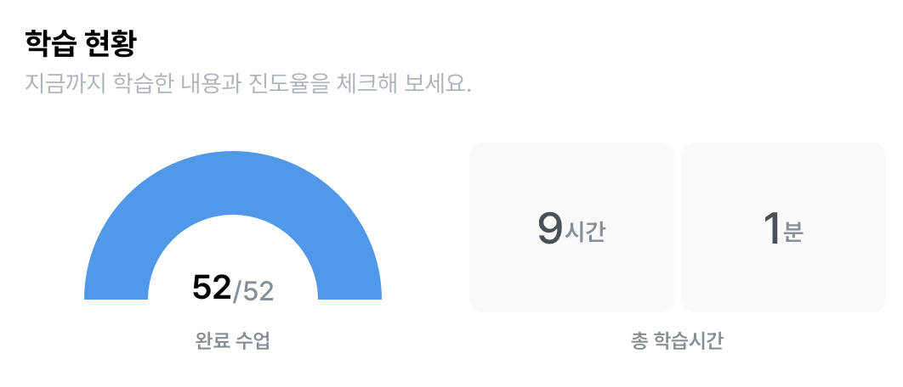

## 8. 총 정리 문제 풀이

### 1. 각 트레이너별로 가진 포켓몬의 평균 레벨을 계산하고, 그 중 평균 레벨이 높은 TOP 3 트레이너의 이름과 보유한 포켓몬의 수, 평균 레벨을 출력해주세요.
- 중복 제거 : DISTINCT, GROUP BY 둘 다 사용 가능

 ```SQL 
WITH trainer_avg_level AS (
  SELECT
# (1) 트레이너가 보유한 포켓몬의 평균 레벨, 포켓몬의 수
  trainer_id,
  ROUND(AVG(level), 2) AS avg_level,
  COUNT(id) AS pokemon_cnt
FROM basic.trainer_pokemon
WHERE
  status != "Released" # = : 같다. != 같지 않다
GROUP BY
  trainer_id
)

# (2) : (1)에서 만든 테이블 + trainer 테이블을 합쳐서 trainer의 name을 출력
SELECT
  t.name,
  tal.avg_level,
  tal.pokemon_cnt
FROM basic.trainer AS t
LEFT JOIN trainer_avg_level AS tal
ON t.id = tal.trainer_id
ORDER BY
  avg_level DESC
LIMIT 3
 ```


### 문제 2. 각 포켓몬 타입1을 기준으로 가장 많이 포획된(방출 여부 상관없음) 포켓몬의 타입1, 포켓몬의 이름과 포획 횟수를 출력해주세요.
```SQL
SELECT
  type1,
  kor_name,
  COUNT(tp.id) as cnt
FROM basic.trainer_pokemon AS tp
LEFT JOIN basic.pokemon AS p 
ON tp.pokemon_id = p.id
GROUP BY
  type1,
  kor_name
ORDER BY
  cnt DESC
LIMIT 3
```


### 문제 3. 전설의 포켓몬을 보유한 트레이너들은 전설의 포켓몬과 일반 포켓몬을 얼마나 보유하고 있을까요? (트레이너의 이름을 같이 출력해주세요)
- COUNTIF, SUM(CASE WHEN ~ IS TRUE/NOT TRUE) 둘 다 사용 가능

```SQL
WITH legendary_cnts AS (
  SELECT
    tp.trainer_id,
    -- SUM(CASE WHEN p.is_legendary THEN 1 ELSE 0 END) AS legendary_cnt,
    SUM(CASE WHEN p.is_legendary IS TRUE THEN 1 ELSE 0 END) AS legendary_cnt,
    -- SUM(CASE WHEN NOT p.is_legendary THEN 1 ELSE 0 END) AS normal_cnt 
    SUM(CASE WHEN p.is_legendary IS NOT TRUE THEN 1 ELSE 0 END) AS normal_cnt
  FROM basic.trainer_pokemon AS tp
  LEFT JOIN basic.pokemon AS p
  ON tp.pokemon_id = p.id
  WHERE tp.status IN ("Active", "Training")
  GROUP BY
    tp.trainer_id
)

# legendary_cnts + trainer
SELECT
  t.name AS trainer_name,
  lc.legendary_cnt,
  lc.normal_cnt
FROM basic.trainer AS t
LEFT JOIN legendary_cnts AS lc
ON t.id = lc.trainer_id
WHERE
  lc.legendary_cnt >= 1 
# SUM(CASE WHEN )

```


### 4. 가장 승리가 많은 트레이너 ID,  트레이너의 이름, 승리한 횟수, 보유한 포켓몬의 수, 평균 포켓몬의 레벨을 출력해주세요. 단, 포켓몬의 레벨은 소수점 2째 자리에서 반올림해주세요
- ROUND: 반올림
- WITH문을 잘 사용하자

```SQL
# (1) winner_id, COUNT(승리 횟수)
WITH winner_counts AS (
  SELECT
    winner_id,
    COUNT(winner_id) AS win_counts
  FROM basic.battle
  WHERE
    winner_id IS NOT NULL
  GROUP BY
    winner_id
), top_winner AS (

  # (2) 이름 추가
  SELECT
    wc.winner_id AS trainer_id,
    wc.win_counts,
    t.name AS trainer_name
  FROM winner_counts AS wc
  LEFT JOIN basic.trainer AS t
  ON wc.winner_id = t.id
  ORDER BY 
    win_counts DESC
  LIMIT 1
)

# (3) 평균 포켓몬 레벨, 포켓몬 수 추가
SELECT
  tw.trainer_id,
  tw.trainer_name,
  tw.win_counts,
  COUNT(tp.pokemon_id) AS pokemon_cnt,
  ROUND(AVG(tp.level), 2) AS avg_level
FROM top_winner AS tw
LEFT JOIN basic.trainer_pokemon AS tp
ON tw.trainer_id = tp.trainer_id
WHERE
  tp.status IN ("Active", "Training")
GROUP BY
  tw.trainer_id,
  tw.trainer_name,
  tw.win_counts
```


### 5. 트레이너가 잡았던 포켓몬의 총 공격력(attack)과 방어력(defense)의 합을 계산하고, 이 합이 가장 높은 트레이너를 찾으세요.

```SQL
WITH total_stats AS (
  SELECT
    tp.trainer_id,
    -- p.attack,
    -- p.defense,
    SUM(p.attack + p.defense) AS total_stat
  FROM basic.trainer_pokemon AS tp
  LEFT JOIN basic.pokemon AS P
  ON tp.pokemon_id = p.id
  GROUP BY
    tp.trainer_id
)

SELECT
  t.name,
  ts.trainer_id,
  ts.total_stat
FROM total_stats AS ts
LEFT JOIN basic.trainer AS t
ON ts.trainer_id = t.id
ORDER BY 
  total_stat DESC
LIMIT 1
```


### 6. 각 포켓몬의 최고 레벨과 최저 레벨을 계산하고, 레벨 차이가 가장 큰 포켓몬의 이름을 출력하세요.
- 포켓몬 레벨 차이(최고 레벨 - 최저 레벨)를 구하고 큰 것부터 정렬
```SQL
(1) 포켓몬의 레벨 차이를 구하는 쿼리
WITH level_diff AS (
  SELECT
    tp.pokemon_id, 
    p.kor_name,
    MIN(tp.level) AS min_level,
    MAX(tp.level) AS max_level,
    MAX(tp.level) - MIN(tp.level) AS level_difference
  FROM basic.trainer_pokemon AS tp
  LEFT JOIN basic.pokemon AS p
  ON tp.pokemon_id = p.id
  GROUP BY
    tp.pokemon_id,
    p.kor_name
)
# pokemon_id => min level : 6, max level : 22. level_difference = 16
# 12 | 16
# min level => MIN
# max level => MAX

SELECT
  kor_name,
  level_difference
FROM level_diff
ORDER BY
  level_difference DESC
LIMIT 1
```


### 7. 각 트레이너가 가진 포켓몬 중에서 공격력(attack)이 100 이상인 포켓몬과 100 미만인 포켓몬의 수를 각각 계산해주세요. 트레이너의 이름과 두 조건에 해당하는 포켓몬의 수를 출력해주세요
- COUNTIF 사용

```SQL
WITH active_and_training_pokemon AS (
  SELECT
    *
  FROM basic.trainer_pokemon
  WHERE
    status IN ("Active", "Training")
), trainer_high_and_low_attack_cnt AS (
  SELECT
    atp.trainer_id,
    # trainer_name은 이후에 JOIN
    COUNTIF(p.attack >= 100) AS high_attack_cnt,
    COUNTIF(p.attack < 100) AS low_attack_cnt
  FROM active_and_training_pokemon AS atp
  LEFT JOIN basic.pokemon AS p
  ON atp.pokemon_id = p.id
  GROUP BY
    atp.trainer_id
)

SELECT
  t.name,
  thala.*
FROM trainer_high_and_low_attack_cnt AS thala
LEFT JOIN basic.trainer AS t
ON thala.trainer_id = t.id

# 확인
-- trainer_id = 5, high_attack_cnt = 0, low_attack_cnt = 7
```

## 강의를 마치며 학습 내용 총 정리
- 데이터 활용 과정
- 데이터 탐색 : 조건과 추출
- 데이터 탐색 : 요약, 집계

- SQL쿼리 작성 흐름
    - 쿼리 작성 템플릿, 생산성 도구
    - 오류를 디버깅 하는 방법

- 데이터 탐색 : 변환
    -데이터 타입과 타입 별 함수
    - BigQuery 공식 문서 확인하는 방법

- 다양한 자료를 연결 : JOIN
- 데이터 결과 검증
    - 가독성을 챙기기 위한 SQL 스타일 가이드


```sql
# 쿼리작성 템플릿
쿼리를 작성하는 목표, 확인할 지표:
쿼리 계산 방법:
데이터의 기간:
사용할 테이블:
Join Key:
데이터 특징:

SELECT

FROM
WHERE
```

>테이블 확인: 테이블에 저장된 데이터, 컬럼 확인 </br>
기준 테이블 정의: 가장 많이 참고할 기준 테이블 정의 </br>
조인 키 찾기: 여러 테이블과 연결할 key 정리 </br>
결과 예상하기: 결과 테이블을 예상해서 손,엑셀로 작성(정답지 역할)</br>
쿼리 작성/검증: 예상한 결과와 동일한 결과가 나오는지 확인

>오류 메시지 읽기!

---


