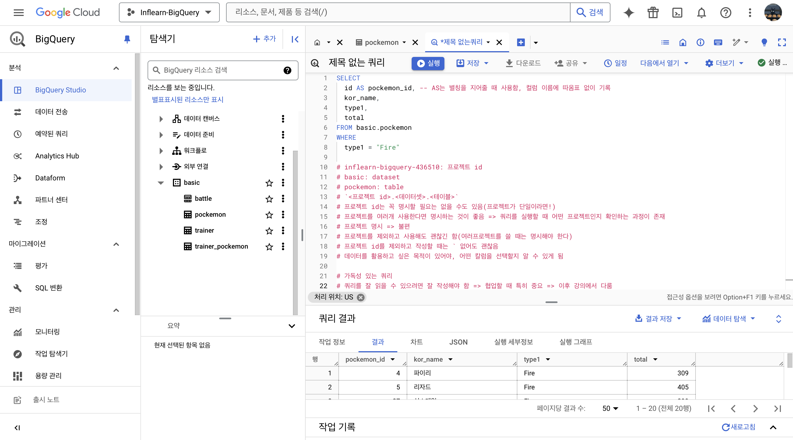
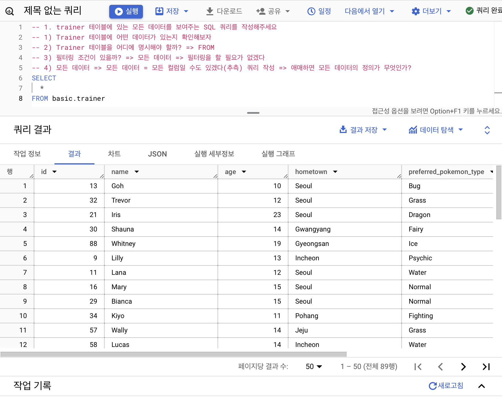
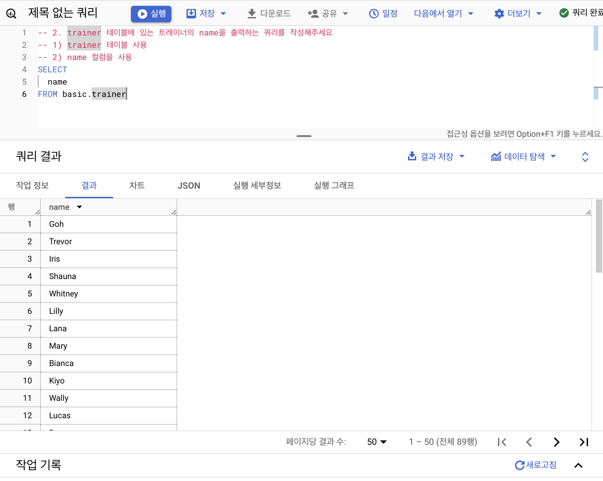
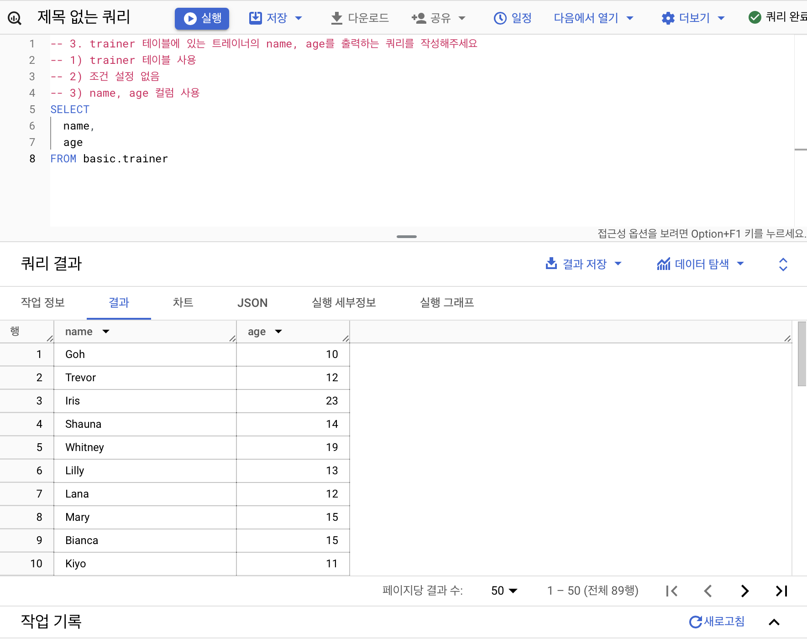
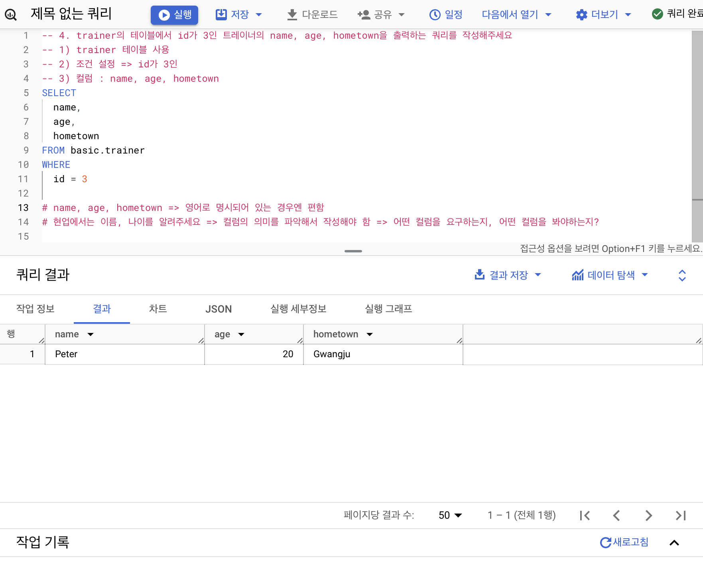
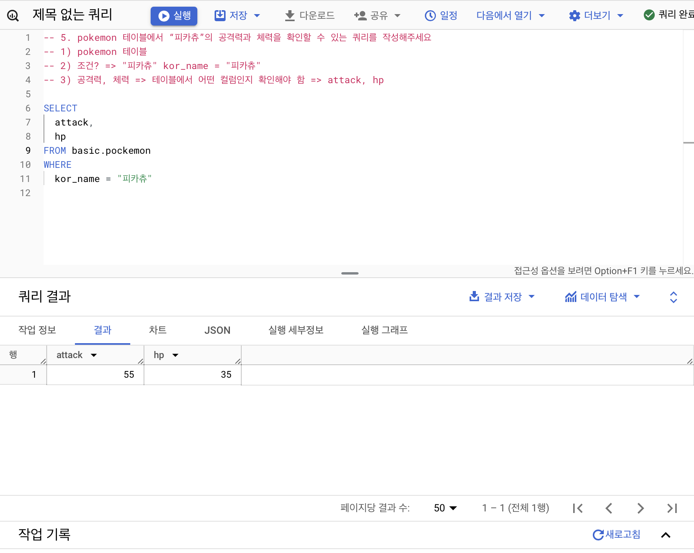
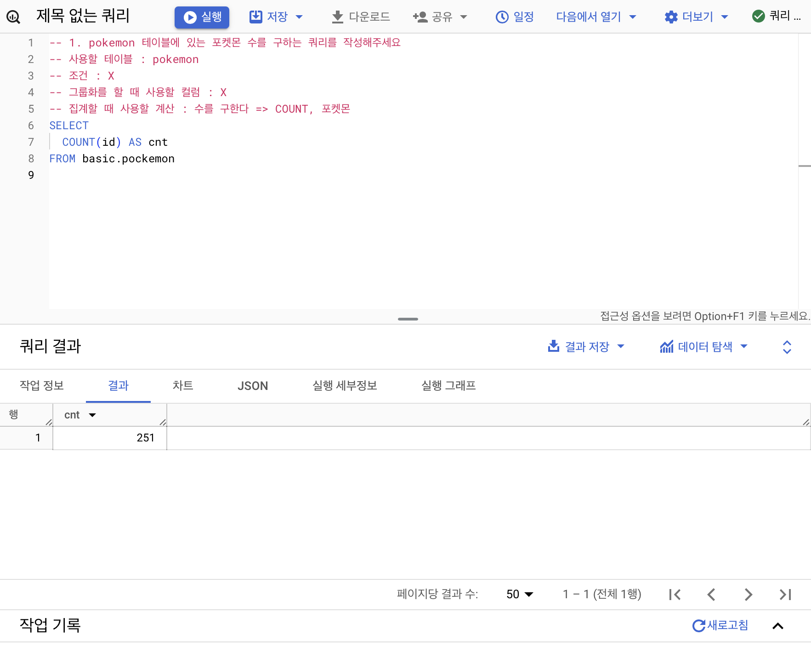
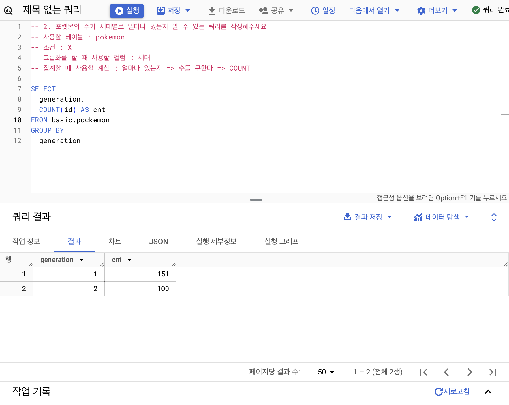
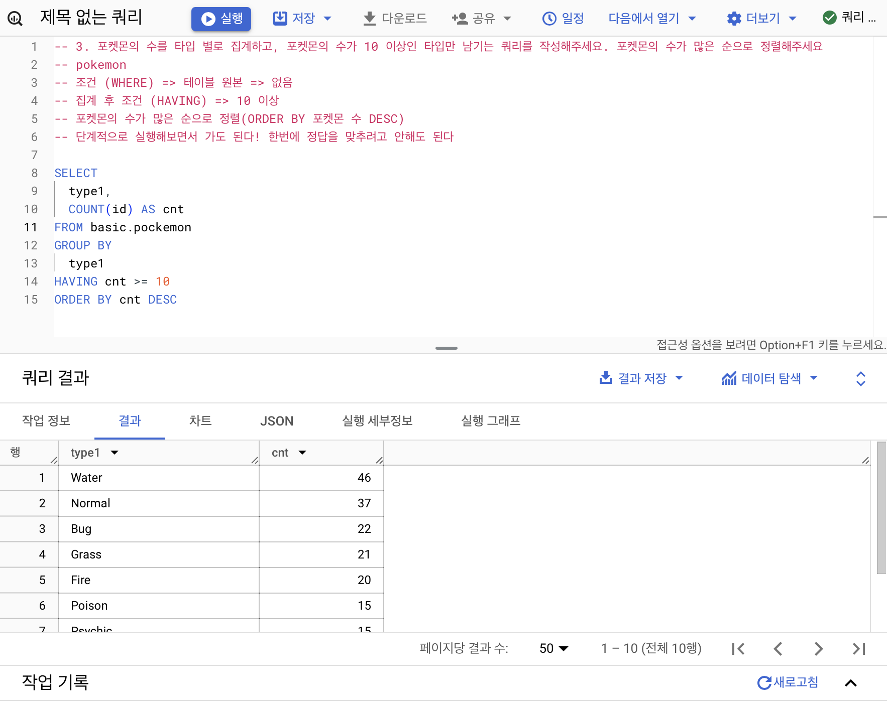
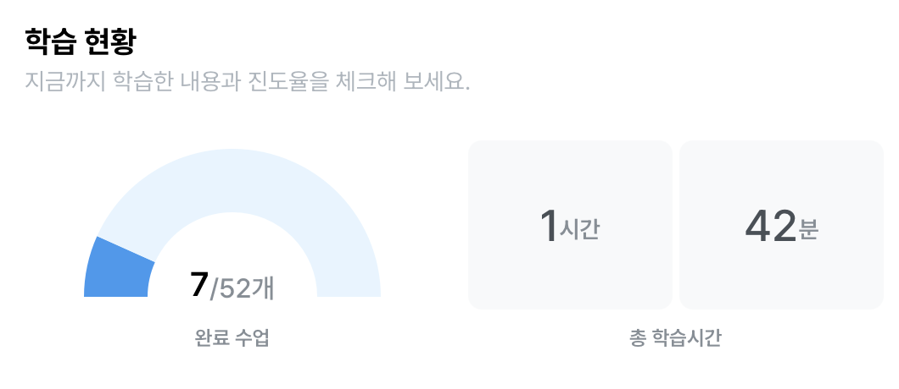

## 2-3. 데이터 탐색(Select, from, where)

### SELECT
Table에 저장되어 있는 컬럼 선택</br>
여러 컬럼 명시 가능</br>
AS "별칭" 지정 가능
```
Col AS new_name(별칭), 
Col2, 
Col3
```
### FROM
데이터를 확인할 Table 명시</br>
이름이 너무 길다면 AS "별칭" 지정 가능
```
Dataset.Table: 어떤 데이블에서 데이터를 확인할 것인가?
```
### WHERE
FROM에 명시된 Table에 저장된 데이터를 필터링
Table에 있는 컬럼을 조건 설정
```
만약 원하는 조건이 있다면 어떤 조건인가?
Col1=1: 조건문 
```

포켓몬 타입이 불인 포켓몬을 찾는 SQL 쿼리
```
SELECT * FROM basic.pockemon
WHERE type1 = "Fire"
```
SELECT * EXCEPT(제외할 칼럼) 형태로도 사용 가능


## 2-4. SELECT 연습문제






## 2-5. 집계(Group by + having + sum/count)
GROUP BY: 같은 값끼리 모아서 그룹화

특정 칼럼을 기준으로 모으면서 다른 컬럼에선 집계 가능(합, 평균, 최대, 최소 등)
```
SELECT
    집계할 컬럼,
    집계 함수(count, max, min ...)
FROM Table
GROUP BY
    집계할 컬럼
```

DISTINCT: 고유값을 알고 싶은 경우</br>
중복을 제거하는 것
```
SELECT
    집계할 컬럼,
    COUNT(DISTINCT count할 컬럼)
FROM Table
GROUP BY
    집계할 컬럼
```



* WHERE: Table에 바로 조건을 설정하고 싶은 경우 사용
* HAVING: GROUP BY 한 후 조건을 설정하고 싶은 경우 사용
두 개를 같이 사용하는 것도 가능!

* 서브쿼리: SELECT문 안에 존재하는 SELECT 쿼리
* ORDER BY: 쿼리의 맨 마지막에서 정렬
* LIMIT: 쿼리문의 결과 Row 수를 제한



```
집계하고 싶은 경우: GROUP집계함수(AVG,등)
고유값을 알고 싶은 경우: DISTINCT
조건을 설정하고 싶은 경우: WHERE/HAVING
정렬하고 싶은 경우: ORDER
출력 개수를 제한하고 싶은 경우: LIMIT
```

