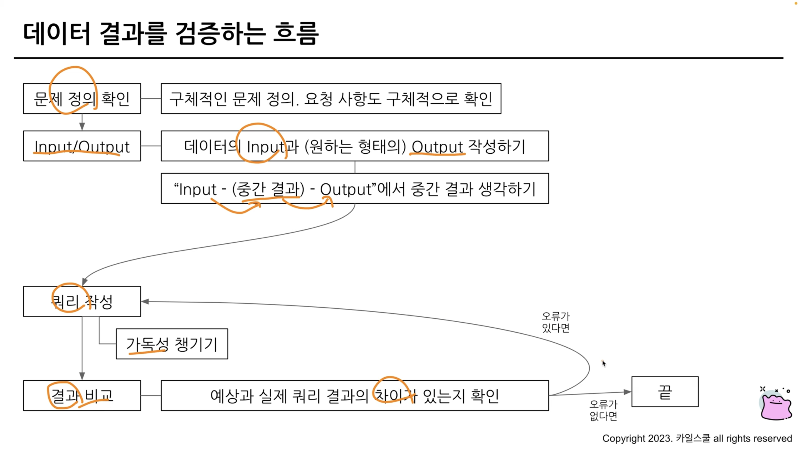

## 6-1. Intro
### 데이터를 어떻게 잘 검증할 것인가

## 6-2. 가독성을 챙기기 위한 SQL 스타일 가이드
### 데이터 결과 검증 전
실수는
* 문법을 잘못 아는 경우
* 테이터 파악 없이 쿼리를 작성하는 경우
* 쿼리가 복잡한 경우
에 발생한다

쿼리를 잘 정리하고 작성해서 다른사람이 쉽게 이해할 수 있도록 하는 것이 중요하다.

### SQL 스타일 가이드
SQL 스타일 가이드, Mozila(firefox)의 SQL 스타일 가이드 참고 가능

1. 예약어는 대문자로 작성한다
* SELECT, FROM, WHERE, AS 등

2. 컬럼 이름은 snake_case로 작성한다
* event_status등과 같이 언더스코어 사용, 일관성 있게 사용하도록

3. 명시적, 암시적 이름
* Alias로 별칭을 지을 때는 명시적인 이름을 사용 
* JOIN시에도 가능하다면 테이블 이름도 명시적으로 진행하기

4. 왼쪽 정렬
* 기본적으로 왼쪽 정렬을 기준으로 작성

5. 예약어나 컬럼은 한 줄에 하나씩 권장
* 컬럼은 바로 주석처리 할 수 있는 장점이 있으므로 한 줄에 하나씩 작성

6. 쉼표는 컬럼 바로 뒤에
* Big Query는 마지막 쉼표를 무시하므로 뒤에 작성해도 무방

## 6-3. 가독성을 챙기기 위한 WITH 문 & 파티션
### WITH 구문
* CTE라고 표현
* SELECT 구문에 이름을 정해주는 것과 유사
* 쿼리 재정의, 재사용 가능
* 쿼리 내에서 반복적으로 사용 가능
```SQL
WIH name_a AS(
    SELECT
        col
    FROM Table
),name_b AS(
    SELECT
        col2
    FROM Table_2
)
SELECT
    col
FROM name_a
```
### PARTITION
* Table에 Partition이란 것이 존재할 수 있음
* 쿼리 성능 향상, 파티션을 설정한 곳만 스캔하면 속도 향상
* 데이터 관리 용이성, 변경과 삭제가 용이함
* 비용 절감 가능

## 6-4. 데이터 결과 검증 정의
### 데이터 결과 검증을 잘 하기 위한 마인드셋
데이터 결과 검증을 하지 못해 실수할 수 있지만 실수를 반복하지 않도록 생각하고 회고하자

### 데이터 결과 검증
* SQL 쿼리 후 얻은 결과가 예상과 일치하는지 확인하는 과정
    * 분석 결과의 정확성, 신뢰성 확보
    * 문제를 잘 정의하고 미리 작성해보기
    * 도메인 특수성을 잘 파악하기

* 데이터 결과 검증 흐름
    * 문제 정의 확인: 구체적인 문제 정의, 요청 사항 구체적으로 확인
    * Input/Output: 원하는 형태의 Input과 Output 작성하기 (바라는 아웃풋의 형태를 구체적으로, 손으로라도 그려봐라)
    * Input - (중간결과) - Output 에서 중간 결과 생각하기
    * 쿼리 작성 - 가독성 챙기기
    * 결과 비교: 예상과 실제 쿼리 결과의 차이가 있는지 확인 - 오류가 있다면 다시 쿼리 작성으로 돌아가기
    * 끝

* 데이터 결과 검증시 자주 활용하는 SQL 쿼리
    * COUNT: 행 수 확인
    * NOT NULL: NULL 존재 확인
    * DISTINCT: 중복 여부 확인
    * IF, CASE WHEN: 의도와 맞는지 확인

* 데이터 검증 시 활용 방식
    * 특정 user_id로 필터 걸어 확인
    * 샘플 데이터 생성하기

## 6-5. 데이터 결과 검증 예시
### 데이터 결과 검증 프로세스 흐름
1. 전체 데이터 파악
2. 특정 use_id 선정
3. 승률 직접 COUNT: 결과 예상
4. 쿼리 작성
5. 실제와 비교
6. 맞다면 특정 유저 조건 제외

## 6-6. 정리

--

